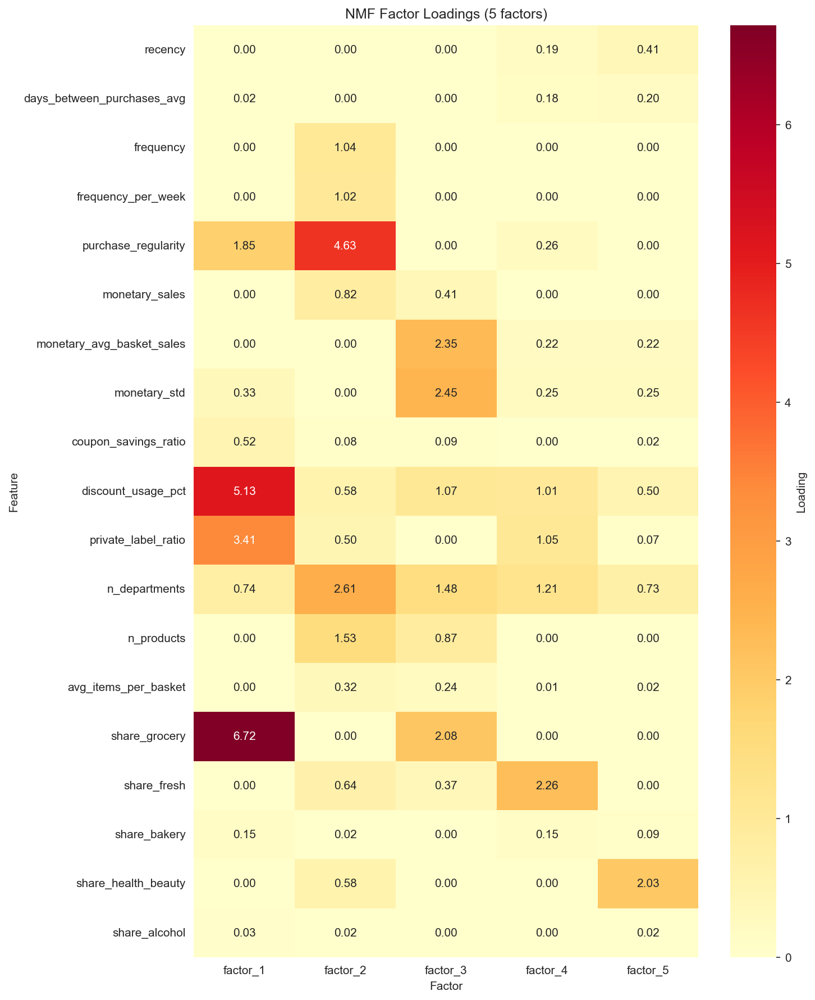
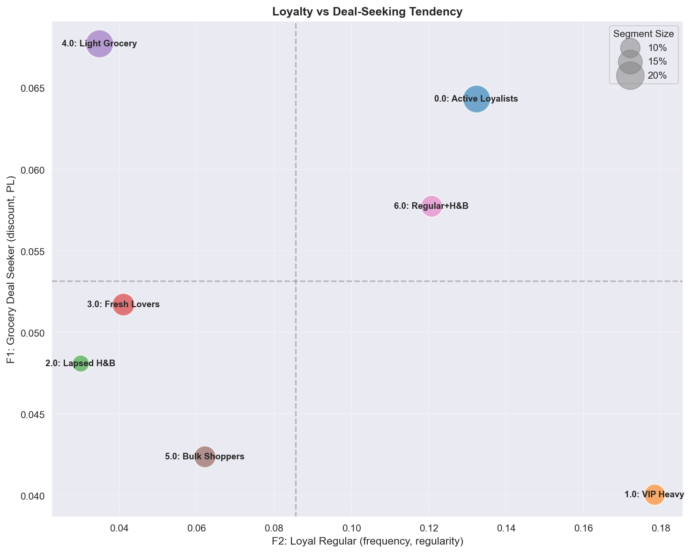
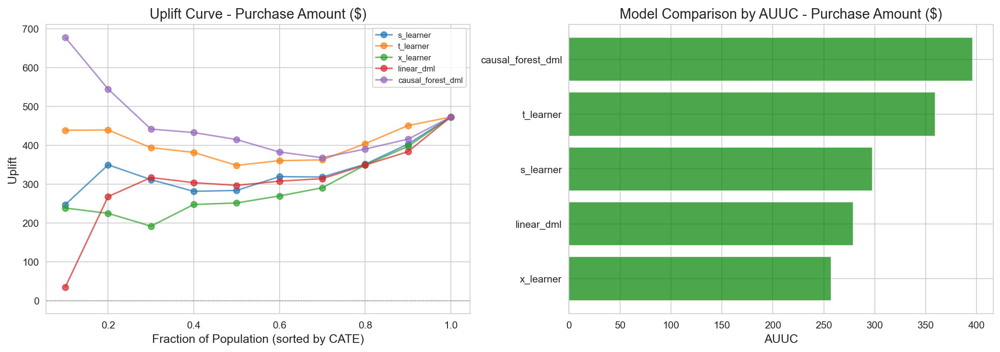
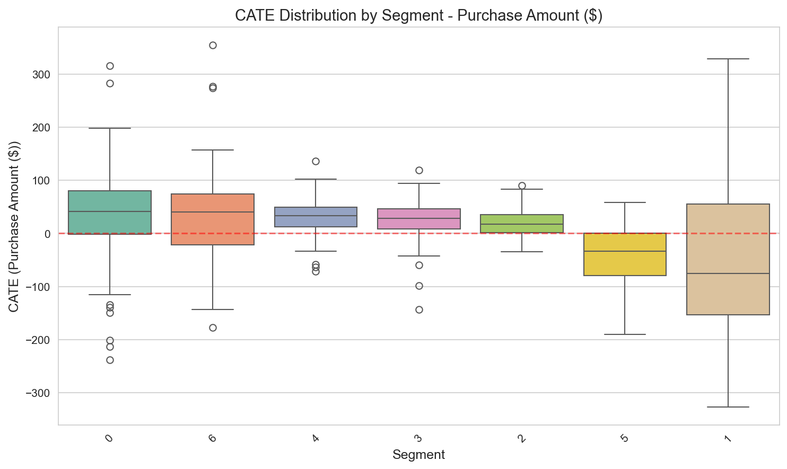

# Customer Segmentation & Causal Targeting - Dunnhumby

## Executive Summary

본 프로젝트는 **2,500 가구 × 260만 거래** 리테일 데이터에서 **7개 고객 세그먼트를 정의**하고 세그먼트별 마케팅 전략을 수립하였으며, 인과 추론을 통해 **$7,000+ 잠재적 수익 개선**을 식별한 타겟팅 최적화 분석이다. **2-Track Framework**를 통해 "우리 고객은 누구인가?"와 "누구를 타겟팅해야 하는가?"의 두 가지 핵심 마케팅 문제에 접근한다.

### Key Results

| 핵심 성과 | 수치 |
|----------|------|
| 전체 타겟팅 손실 | -$4,657 (ROI -75%) |
| **최적 31% 타겟팅 수익** | **+$2,426 (ROI 125%)** |
| **개선 효과** | **+$7,083 (+200pp ROI)** |

| Track | 핵심 발견 | 비즈니스 임팩트 |
|-------|----------|-----------------|
| Track 1 | 92.44% 분산 설명의 7개 세그먼트 | CRM을 위한 실행 가능한 고객 프로필 |
| Track 2 | VIP Heavy, Bulk Shoppers **음수 CATE** | 해당 세그먼트 타겟팅 **축소 필수** |
| Track 2 | 31.3% 최적 타겟팅 발견 | $7,000+ 예상 수익 개선 |

### Approach & Technical Highlights

| Track | 방법론 | 핵심 기술 | Output |
|-------|--------|----------|--------|
| Track 1 | NMF → K-Means | Latent Factor Modeling, Bootstrap 안정성 검증 | 7개 세그먼트 + 마케팅 전략 |
| Track 2 | Meta-Learners → Policy | CATE Estimation (5 models), Optuna 100 trials, AUUC 기반 선택 | ROI 최적 31% 타겟팅 규칙 |

**프로젝트 차별점:**
- **End-to-End Analysis**: EDA → Segmentation → Causal Inference → Optimal Policy
- **실제 데이터 복잡성 대응**: Positivity Violation, 모델 간 추정치 불일치 등 관찰 데이터 한계 대응 및 의사결정
- **비즈니스 번역**: CATE → 세그먼트별 ROI 기반 마케팅 액션 도출

---

## Motivation & Framework

본 프로젝트에서는 전통적인 세그멘테이션의 "우리 고객은 누구인가?"의 질문과 인과추론 기반의 "이 캠페인이 누구에게 얼마나 효과가 있을까?"의 문제에 대한 접근이다.

```
┌─────────────────────────────────────────────────────────────────────────────┐
│                         2-TRACK FRAMEWORK                                   │
├─────────────────────────────────────────────────────────────────────────────┤
│                                                                             │
│  TRACK 1: CUSTOMER UNDERSTANDING                                            │
│  ════════════════════════════════                                           │
│                                                                             │
│  "우리 고객은 누구인가?"                                                         │
│                                                                             │
│  • Latent Factor Modeling (NMF)   → 행동 차원 발견                             │
│  • Clustering (K-Means)           → 실행 가능한 세그먼트 도출                     │
│  • Stability Validation           → 세그먼트 신뢰성 보장                         │
│                                                                             │
│  Output: 마케팅 전략을 위한 고객 프로필                                            │
│                                                                             │
├─────────────────────────────────────────────────────────────────────────────┤
│                                                                             │
│  TRACK 2: CAUSAL TARGETING                                                  │
│  ═════════════════════════                                                  │
│                                                                             │
│  "누구를 타겟팅해야 하는가?"                                                      │
│                                                                             │
│  • Heterogeneous Treatment Effects → 고객별 캠페인 효과                         │
│  • Validation & Refutation         → HTE 신뢰성 검증                           │
│  • Policy Learning                 → 최적 타겟팅 규칙                           │
│  • ROI Optimization                → 캠페인 수익 극대화                         │
│                                                                             │
│  Output: 데이터 기반 타겟팅 정책                                                 │
│                                                                             │
└─────────────────────────────────────────────────────────────────────────────┘
```

**왜 두 Track 모두 필요한가?**

| 측면 | Track 1 (Descriptive) | Track 2 (Causal) |
|------|----------------------|------------------|
| 핵심 질문 | "이 고객은 누구인가?" | "이 고객에게 캠페인이 효과적일까?" |
| 주요 사용자 | 마케팅, CRM, 전략 | Data Science, 최적화 |
| 설명 가능성 | "Premium Fresh Lover 세그먼트" | "이 고객의 CATE = +$34" |
| 조직 요구사항 | 고객 이해 기반 마케팅 역량 | Causal thinking + 개인화 타겟팅 실행 체계 |

---

## Key Insights: 반직관적 발견

### 고가치 고객의 음의 Treatment Effect

| 세그먼트 | 고객 가치 | Mean CATE | 현재 타겟팅 | 권고 |
|----------|----------|-----------|------------|------|
| **VIP Heavy** | $9,716 (최고) | **-$38** | 97% | **50%로 축소** |
| **Bulk Shoppers** | $3,206 | **-$40** | 52% | **20%로 축소** |

**왜 고가치 고객이 음의 CATE를 보이는가?**

| 세그먼트 | 원인 분석 |
|----------|----------|
| **VIP Heavy** | 이미 High Purchaser → **Ceiling Effect**, 쿠폰이 기존 구매를 대체 (Cannibalization) |
| **Bulk Shoppers** | 쿠폰 기반 TypeA가 비정기 대량 구매 쇼핑 리듬과 **미스매치** |

**비즈니스 임팩트:**

```
전체 타겟팅 (100%):  -$4,657 손실
    ↓ Negative Responder가 양의 효과를 상쇄
최적 타겟팅 (31%):   +$2,426 수익
    ↓ 음의 CATE 고객 제외
개선 효과:           +$7,083 (+200pp ROI)
```

---

## Methodology

### Analysis Pipeline

```
┌────────────────────────────────────────────────────────────────┐
│                    ANALYSIS PIPELINE                           │
├────────────────────────────────────────────────────────────────┤
│                                                                │
│  [Transaction Data: 260만 거래]                                 │
│        │                                                       │
│        ▼                                                       │
│  ┌─────────────────┐                                           │
│  │ Feature Eng.    │ → 33 Customer Features                    │
│  │ (RFM, Category) │   (Recency, Frequency, Monetary,          │
│  └────────┬────────┘    Behavioral, Category, Time)            │
│           │                                                    │
│    ┌──────┴──────┐                                             │
│    ▼             ▼                                             │
│ [TRACK 1]     [TRACK 2]                                        │
│    │             │                                             │
│    ▼             ▼                                             │
│ ┌──────┐    ┌──────────┐                                       │
│ │ NMF  │    │ PS Model │ → Positivity Check (AUC=0.989)        │
│ │(k=5) │    │(XGBoost) │                                       │
│ └──┬───┘    └────┬─────┘                                       │
│    │             │                                             │
│    ▼             ▼                                             │
│ ┌───────┐   ┌───────────┐                                      │
│ │K-Means│   │CATE Models│ → S/T/X/R-Learner, CausalForest      │
│ │(k=7)  │   │(5 models) │   + Optuna 100 trials tuning         │
│ └──┬────┘   └────┬──────┘                                      │
│    │             │                                             │
│    ▼             ▼                                             │
│ [7 Segments] ─→ [Moderator] ─→ [Policy Learning]               │
│                                      │                         │
│                                      ▼                         │
│                              [Optimal 31% Targeting]           │
│                              → $2,426 profit (125% ROI)        │
└────────────────────────────────────────────────────────────────┘
```

### Track 1: Customer Segmentation

> **Why NMF + K-Means?**
> - **해석력**: 비음수 제약으로 직관적인 Factor 해석 가능 → 마케팅 관계자와 소통 용이
> - **빠른 반복 실험**: 파라미터 튜닝 및 실험 반복이 빠름 → 세그먼트 정의를 지속적으로 수정/개선
> - 고객 세그멘테이션은 마케팅 팀과의 협업이 핵심이므로, 복잡한 모델보다 **소통 가능한 해석력**과 **빠른 실험 사이클**이 중요

**NMF (Non-negative Matrix Factorization)**

수식:
```
V ≈ W × H

- V: 고객-Feature 행렬 (n × m)
- W: 고객-Factor 행렬 (n × k)  → 고객별 Factor Score
- H: Factor-Feature 행렬 (k × m) → Factor의 Feature 가중치
```

**K-Means Clustering**

```
min Σᵢ Σⱼ ||wᵢ - μⱼ||²

- wᵢ: 고객 i의 Factor Score 벡터 (from W)
- μⱼ: 클러스터 j의 중심 (centroid)
- 목표: 클러스터 내 분산 최소화
```

**의사결정 근거:**

| 결정 | 선택 | 근거 |
|------|------|------|
| Factor 수 (k) | **5** | Elbow Method + 92.44% 분산 설명 |
| 정규화 | MinMax [0,1] | NMF 비음수 제약 조건 충족 |
| Clustering | K-Means (k=7) | DBI 최소 (1.241), Silhouette 안정 |
| 안정성 검증 | Bootstrap 100회 | ARI = 0.77 ± 0.11 |

**Clustering k 선택 과정:**

| k | Silhouette | Calinski-Harabasz | Davies-Bouldin |
|---|------------|-------------------|----------------|
| 5 | 0.234 | 812.4 | 1.312 |
| 6 | 0.225 | 756.8 | 1.287 |
| **7** | **0.219** | **732.0** | **1.241** |
| 8 | 0.211 | 698.5 | 1.298 |

→ **k=7 선택**: DBI 최소 (클러스터 간 분리 최적), Silhouette 안정적

### Track 2: Causal Targeting

**CATE (Conditional Average Treatment Effect)**

수식:
```
τ(x) = E[Y(1) - Y(0) | X = x]

- Y(1): Treatment를 받을 경우의 Potential Outcome
- Y(0): Treatment를 받지 않을 경우의 Potential Outcome
- X: Pre-treatment Covariates
```

**Breakeven CATE:**
```
Breakeven = Cost / Margin = $12.73 / 0.30 = $42.43

→ CATE > $42.43인 고객만 타겟팅 시 수익
```

**의사결정 근거:**

| 결정 | 선택 | 근거 |
|------|------|------|
| Study Design | First Campaign Only | Clean causal ID (Pre-treatment contamination 방지) |
| CATE 모델 | **CausalForestDML** | AUUC 396.3 (최고), 분산 $88 (안정적) |
| Policy | CATE > Breakeven | 31.3% 타겟팅, $2,426 수익 |
| 검증 | A/B Test 설계 | n=5,748 (80% Power, MDE $30) |

**Positivity 진단 및 대응:**

| 진단 | 값 | 의미 | 대응 |
|------|-----|------|------|
| PS AUC | **0.989** | Treatment가 거의 완벽히 예측됨 | Overlap 영역 집중 |
| Overlap [0.1, 0.9] | **17%** | 83%는 외삽 필요 | PS Trimming |
| Balanced Covariates | 9/21 | 대다수 불균형 | ATO Weighting |
| Manski Bounds | [$-∞, +∞] | 비식별 구간 넓음 | 보수적 해석 |


*Treatment/Control 간 PS 분포. **17%만 Overlap 영역**에 존재하여 심각한 Positivity Violation을 보인다.*

---

## Results Summary

### Track 1 Results: Latent Factor Modeling + Clustering

**5개 Latent Factor 해석:**

| Factor | 명칭 | 상위 Feature | 해석 |
|--------|------|-------------|------|
| **F1** | Grocery Deal Seeker | share_grocery, discount_pct | 할인 추구 예산 중시 |
| **F2** | Loyal Regular | regularity, n_dept, frequency | One-stop 고관여 (Value) |
| **F3** | Big Basket | monetary_std, avg_basket | 비정기 대량 구매 (Value) |
| **F4** | Fresh Focused | share_fresh, n_dept | 신선식품 전문가 (Need) |
| **F5** | Health & Beauty | share_h&b | 드럭스토어 유형 (Need) |


*5개 Latent Factor의 Feature Loading. F2(Loyal)와 F3(Big Basket)이 **Value 차원**, F4(Fresh)와 F5(H&B)가 **Need 차원**을 포착한다.*

**Clustering 평가 메트릭:**

| 메트릭 | 값 | 해석 |
|--------|-----|------|
| Explained Variance | 92.44% | 높은 Factor 커버리지 |
| Silhouette Score | 0.219 | 행동 데이터로서 적절 |
| Calinski-Harabasz | 732.0 | 높은 클러스터 간 분산 |
| Davies-Bouldin Index | 1.241 | 양호한 클러스터 분리 |
| Bootstrap ARI | 0.77 ± 0.11 | 높은 세그먼트 안정성 |

**7개 고객 세그먼트:**

| Seg | 명칭 | 규모 | 평균 매출 | Frequency | 주요 Factor |
|-----|------|------|----------|-----------|------------|
| 0 | Active Loyalists | 509 (20.4%) | $3,878 | 171회 | F2 (Loyal) |
| 1 | **VIP Heavy** | 299 (12.0%) | **$9,716** | 256회 | F2 (Loyal) |
| 2 | Lapsed H&B | 193 (7.7%) | $872 | 37회 | F5 (H&B) |
| 3 | Fresh Lovers | 339 (13.6%) | $1,233 | 76회 | F4 (Fresh) |
| 4 | Light Grocery | 524 (21.0%) | $1,100 | 58회 | F4 (Fresh) |
| 5 | **Bulk Shoppers** | 318 (12.7%) | $3,206 | 56회 | F3 (Basket) |
| 6 | Regular + H&B | 318 (12.7%) | $3,393 | 141회 | F2 (Loyal) |


*Loyalty (F2) × Deal-Seeking (F1) 포지셔닝. VIP Heavy는 **High Loyalty + Low Deal** (프리미엄 충성), Active Loyalists는 **High Loyalty + High Deal** (예산 중시 충성).*

**세그먼트별 마케팅 전략 (Track 1 기반):**

| 세그먼트 | 우선순위 | 전략 | 주요 액션 |
|----------|----------|------|----------|
| VIP Heavy | High | Retention | 프리미엄 혜택, Churn 예측, 독점 접근 |
| Active Loyalists | High | Strengthen | PB 프로모션, 로열티 포인트, 장바구니 확대 |
| Regular + H&B | Medium | Upgrade | VIP 전환 프로그램, Cross-category 인센티브 |
| Bulk Shoppers | Medium | Regularize | 구독 제안, 정기 배송, 번들 딜 |
| Fresh Lovers | Medium | Engage | 신선식품 콘텐츠, 일일 특가, 레시피 |
| Light Grocery | Low | Activate | 습관 형성 캠페인, 점진적 보상 |
| Lapsed H&B | Low | Win-back | 재관여 캠페인, H&B 집중 오퍼 |

> 💡 **Track 1 vs Track 2 전략 차이**: Track 1은 고객 특성 기반 일반 전략, Track 2는 CATE 기반 TypeA 캠페인 타겟팅 전략. VIP Heavy는 Track 1에서 "Retention"이지만, Track 2에서는 TypeA 타겟팅 "축소" 권고.

### Track 2 Results: CATE 및 최적 타겟팅

**ATE 추정 (방법별):**

| 방법 | ATE | 95% CI | 신뢰성 |
|------|-----|--------|--------|
| Naive | $471 | [$442, $501] | ❌ 상향 편향 |
| IPW | $151 | [-$10, $313] | ⚠️ 불안정 |
| **ATO (Overlap)** | **$60** | [-$15, $111] | ✅ Overlap 집중 |
| DML Trimmed | $21-41 | — | ✅ Trimmed 샘플 |

**CATE 모델 성과:**

| 모델 | 평균 CATE | AUUC | 분산 | 선택 |
|------|-----------|------|------|------|
| **CausalForestDML** | **+$10** | **396.3** | $88 | ✅ Primary |
| T-Learner | -$71 | 359.3 | $281 | ❌ 높은 분산 |
| LinearDML | -$91 | 279.0 | $851 | ❌ 극단적 분산 |


*CATE 모델별 AUUC 비교. CausalForestDML(396.3)이 최고 Uplift 달성. **상위 30% 타겟팅 시 $2,400+ 추가 수익** 예상.*

### 세그먼트별 마케팅 액션

| 세그먼트 | N | Mean CATE | 현재 타겟팅 | 권장 타겟팅 | 액션 |
|----------|---|-----------|------------|------------|------|
| Regular+H&B | 62 | **+$34** | 76% | 85%+ | 타겟팅 확대 |
| Active Loyalists | 97 | **+$33** | 90% | 95%+ | 유지 |
| Light Grocery | 91 | **+$30** | 15% | 45% | **3배 확대** |
| Fresh Lovers | 73 | **+$27** | 27% | 55% | 2배 확대 |
| Lapsed H&B | 27 | +$19 | 20% | 35% | Test & Learn |
| **VIP Heavy** | 14 | **-$38** | 97% | 50% | **축소 필수** |
| **Bulk Shoppers** | 22 | **-$40** | 52% | 20% | **축소 필수** |


*세그먼트별 CATE 분포. **VIP Heavy(-$38)와 Bulk Shoppers(-$40)의 음의 효과**가 명확하다.*

### Policy 비교 분석

| Policy | 기준 | Target % | Profit | ROI | 특징 |
|--------|------|----------|--------|-----|------|
| **CATE > Breakeven** | Point est. > $42.43 | **31.3%** | **$2,426** | **125%** | ✅ 최적 |
| **Conservative** | Lower CI > $42.43 | 5.6% | $1,343 | 391% | 안전 (A/B 전) |
| Top 30% | Percentile | 30% | $2,423 | 131% | 예산 제약 시 |
| PolicyTree | 학습된 규칙 | 22% | $1,710 | 35% | 해석 가능 |
| **전체 타겟팅** | — | 100% | **-$4,657** | **-75%** | ❌ **손실** |


*타겟팅 비율별 ROI. **31.3%에서 최적(125% ROI)**, 100% 타겟팅 시 **-75% ROI로 손실** 발생.*

---

## Limitations & Lessons Learned

| 한계 | 증거 | 완화책 |
|------|------|--------|
| **Positivity Violation** | PS AUC = 0.989, 17% Overlap | PS Trimming, ATO Weighting, Manski Bounds |
| **Refutation Test 실패** | Placebo Ratio 0.75, Subset Corr 0.56 | A/B Test 검증 설계 (n=5,748) |
| **모델 불일치** | CausalForest +$10 vs LinearDML -$91 | AUUC 기반 선택, 방향 불일치 인정 |
| **단일 캠페인 유형** | TypeA만 분석 | TypeB/C 별도 분석 필요 |

### 교훈

> "PS AUC 0.989는 Observational Study의 근본적 한계를 보여준다.
> 결과를 **가설 생성적(hypothesis-generating)**으로 해석하고,
> **A/B Test로 검증 후 배포**해야 한다."

### 향후 방향

1. **A/B Test 검증**: n=5,748 (80% Power, MDE $30)으로 가설 검증
2. **ε-greedy Exploration**: 모든 고객에 최소 ε 확률로 treatment 할당 → Positivity 보장
3. **MLOps 확장**: CATE 모니터링 대시보드, 모델 재훈련 파이프라인

---

## Technical Reports

자세한 방법론, 결과, 비즈니스 해석은 다음을 참조한다:

- **[Track 1 Report](docs/track1_report.md)**: Customer Segmentation Analysis
  - NMF Factor 해석, 세그먼트 프로필, 세그먼트별 마케팅 액션

- **[Track 2 Report](docs/track2_report.md)**: Causal Targeting Analysis
  - Positivity Diagnostics, CATE 추정, Policy 비교, A/B Test 설계

---

## Project Structure

```
projects/kr_segmentation_causal_targeting_dunnhumby/
├── notebook/           # 분석 노트북 (6개)
├── src/                # Python 모듈 (11개 파일)
├── docs/               # 기술 보고서 (track1_report, track2_report, interview)
└── results/
    ├── figures/        # 65개 시각화 파일
    └── *.csv           # 28개 결과 테이블
```

---

## Notebooks

### Track 1: Customer Segmentation

| 노트북 | 설명 |
|--------|------|
| [00_study_design.ipynb](notebook/00_study_design.ipynb) | Study Design 및 2-Track Framework |
| [01_feature_engineering.ipynb](notebook/01_feature_engineering.ipynb) | 33개 고객 Feature 구성 |
| [02_customer_profiling.ipynb](notebook/02_customer_profiling.ipynb) | NMF Latent Factor + K-Means Segmentation |

### Track 2: Causal Targeting

| 노트북 | 설명 |
|--------|------|
| [03a_hte_estimation.ipynb](notebook/03a_hte_estimation.ipynb) | 다양한 방법을 통한 ATE/CATE 추정 |
| [03b_hte_validation.ipynb](notebook/03b_hte_validation.ipynb) | 검증, Refutation Test, Bounds |
| [04_optimal_policy.ipynb](notebook/04_optimal_policy.ipynb) | Policy Learning 및 ROI 최적화 |

### Source Modules (`src/`)

| Module | Description |
|--------|-------------|
| `features.py` | 33개 고객 Feature 추출 (RFM, Behavioral, Category, Time) |
| `segments.py` | NMF Latent Factor + K-Means 세그멘테이션 |
| `cohorts.py` | 캠페인별 Treatment/Control 코호트 구성 |
| `treatment_effects.py` | ATE/CATE 추정, Positivity 진단, Manski Bounds |
| `policy.py` | Policy Learning (IPW/DR Value Estimation) |
| `metrics.py` | Uplift 메트릭 (AUUC, Qini, RATE) |
| `business.py` | ROI 계산, 세그먼트별 권고 |
| `plots.py` | HTE/Policy 시각화 함수 |

---

## Technical Stack

- **Data Processing**: pandas, numpy
- **Machine Learning**: scikit-learn, xgboost
- **Causal Inference**: econml, dowhy
- **Optimization**: Optuna (hyperparameter tuning), Ray (parallelization)
- **Visualization**: matplotlib, seaborn

---

## Data Source

**Dunnhumby "The Complete Journey"**
- 102주간 2,500 가구
- 260만 거래
- 캠페인 데이터 (TypeA/B/C), 쿠폰 Redemption
- Demographic 세그먼트

데이터셋 문서: [data/dunnhumby/README.md](../../data/dunnhumby/README.md)

---

## Appendix: CausalForestDML 이해

> **Note**: LinearDML은 R-Learner 논문(Nie & Wager, 2021)에서 직접 참조되나, CausalForestDML은 학술 논문에서 독립적으로 정의되지 않음. EconML 패키지가 DML + Causal Forest를 결합한 구현체.

### 출처별 정리

| 아이디어 | 논문 | 핵심 |
|----------|------|------|
| **Causal Forest** | Athey & Wager (2018) | Honest splitting, local CATE 추정 |
| **DML** | Chernozhukov et al. (2018) | Cross-fitting, orthogonalization |
| **R-Learner** | Nie & Wager (2021) | 잔차 기반 CATE 추정 |

### DML/R-Learner 공통 프레임워크

```
Step 1: Nuisance 추정 (비선형 ML 가능)
────────────────────────────────────
m(X) = E[Y|X]     ← XGBoost, RF 등
e(X) = E[T|X]     ← XGBoost, RF 등

Step 2: 잔차 계산
────────────────────────────────────
Ỹ = Y - m(X)      (outcome 잔차)
T̃ = T - e(X)      (treatment 잔차)

Step 3: CATE 추정 ← 여기서 차이 발생
────────────────────────────────────
min_τ E[(Ỹ - τ(X)·T̃)²]
```

### LinearDML vs CausalForestDML

```
LinearDML:
──────────
τ(X) = X'β    (선형 함수)

→ min_β E[(Ỹ - X'β·T̃)²]
→ Weighted Least Squares로 β 추정


CausalForestDML:
────────────────
τ(X) = forest(X)    (비선형 함수)

→ min_forest E[(Ỹ - forest(X)·T̃)²]
→ Causal Forest로 τ(X) 직접 추정
```

### 요약

| 구성 요소 | LinearDML | CausalForestDML |
|-----------|-----------|-----------------|
| Nuisance (Y~X, T~X) | XGBoost 등 비선형 OK | XGBoost 등 비선형 OK |
| **CATE 모델 τ(X)** | **선형** (X'β) | **비선형** (Forest) |

- **LinearDML**: nuisance는 비선형, CATE는 선형 → 해석 용이, 복잡한 HTE 패턴 제한
- **CausalForestDML**: nuisance도 비선형, CATE도 비선형 → 복잡한 HTE 포착 가능
