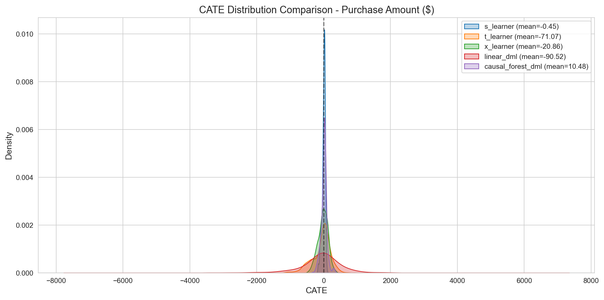
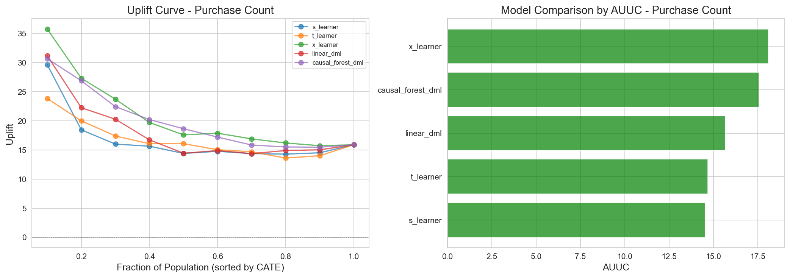

# Heterogeneous Treatment Effects를 활용한 Causal Targeting: 리테일 캠페인 최적화 사례 연구

## 요약

본 분석은 리테일 마케팅 캠페인의 Heterogeneous Treatment Effects (HTE)를 추정하고 최적 타겟팅 정책을 도출하기 위해 Causal Inference 방법론을 적용한다. Dunnhumby "The Complete Journey" 데이터셋을 활용하여, Clean Causal Identification 설계 하에 첫 번째 TypeA 캠페인 노출을 기준으로 2,430명의 고객 (Treatment 1,511명, Control 919명)을 분석하였다.

**주요 결과:**
- **Positivity Violation** (PS AUC = 0.989)이 Causal Identification을 17% Overlap 영역으로 제한
- **Average Treatment Effect (ATE)**: Trimmed 샘플에서 고객당 $20-40
- **Optimal Targeting**: 고객의 31.3% 타겟팅 시 $2,426 수익 (125% ROI)
- **반직관적 인사이트**: VIP Heavy와 Bulk Shoppers (고가치 고객) 가 음의 CATE를 보여 과다 타겟팅 시사
- **전체 고객 타겟팅 시 $4,657 손실** 발생 (Negative Responder로 인함)

**권고사항:**
1. VIP Heavy 및 Bulk Shopper 세그먼트에 대한 TypeA 타겟팅 축소
2. A/B Testing으로 결과 검증 (80% Power를 위해 n=5,748 필요)
3. 검증 후 상위 31% CATE 고객으로 타겟팅 확대

---

## 1. 서론

### 1.1 배경

마케팅 캠페인의 효과는 고객마다 다르다. Average Treatment Effect는 모집단 수준의 인사이트를 제공하지만, 타겟팅 의사결정에 활용할 수 있는 중요한 이질성을 분석할 수 없다. 이미 Heavy Purchaser인 고객은 Light Shopper와 다르게 캠페인에 반응할 수 있다. 이러한 이질성을 이해하면 마케팅 투자 수익률을 극대화하는 Precision Targeting이 가능해진다.

### 1.2 문제 정의

핵심 질문은: **"이 캠페인이 누구에게 효과적인가?"**

전통적인 캠페인 분석은 평균 효과에 집중하여 다음을 놓칠 수 있다:
- 예외적으로 잘 반응하는 고객 (High CATE)
- 부정적으로 반응하는 고객 (Cannibalization 효과)
- 수익을 극대화하는 최적 타겟팅 규칙

### 1.3 Causal Framework

**Potential Outcomes Framework** (Rubin Causal Model)을 채택한다:
- $Y_i(1)$: 고객 $i$가 Treatment를 받을 경우의 Potential Outcome
- $Y_i(0)$: 고객 $i$가 Treatment를 받지 않을 경우의 Potential Outcome
- **CATE**: $\tau(x) = E[Y(1) - Y(0) | X = x]$

**Causal Assumptions:**
| 가정 | 정의 | 상태 |
|------|------|------|
| **SUTVA** | 단위 간 간섭 없음 | OK로 가정 |
| **Unconfoundedness** | 미측정 Confounder 없음 | 불확실 |
| **Positivity** | 모든 고객이 Treatment의 양의 확률 보유 | **위반** |

### 1.4 연구 설계

Clean Causal Identification을 위한 **First Campaign Only** 설계를 적용한다:

| 구성요소 | 설명 |
|----------|------|
| 단위 | 고객 (household_key) |
| Treatment | 첫 번째 TypeA 캠페인 타겟팅 (Binary) |
| Control | 어떤 TypeA 캠페인에도 타겟팅되지 않음 |
| Outcome 기간 | 캠페인 주 + 4주 |
| Outcomes | Purchase Amount ($), Purchase Count |

**왜 First Campaign Only인가?**
- Pre-treatment Contamination 방지 (예: Campaign 30의 Pre-treatment에 Campaign 26의 Treatment가 포함됨)
- 각 고객이 정확히 한 번만 등장 → 독립적 관측
- Trade-off: 62% 샘플 감소이나 더 깨끗한 Causal 추정

### 1.5 Track 1과의 통합

Track 1 (NMF + K-Means)의 고객 세그먼트가 HTE Moderator로 활용되어 세그먼트별 타겟팅 권고를 가능하게 한다.

---

## 2. 방법론

### 2.1 데이터 준비

**샘플 특성:**

| 메트릭 | 값 |
|--------|-----|
| 총 고객 수 | 2,430 |
| Treatment (타겟팅됨) | 1,511 (62.2%) |
| Control (타겟팅 안됨) | 919 (37.8%) |
| Train/Test Split | 80/20 (Stratified) |

**Covariates (21개 Pre-Treatment Features):**

| 그룹 | 개수 | 예시 |
|------|------|------|
| RFM | 9 | recency, frequency, monetary_sales |
| Behavioral | 5 | discount_rate, private_label_ratio, n_departments |
| Category | 5 | share_grocery, share_fresh, share_h&b |
| Exposure | 2 | display_exposure_rate, mailer_exposure_rate |

### 2.2 Positivity 평가

XGBoost Classifier로 5-Fold Cross-Validation을 통해 Propensity Score를 추정하였다.

**진단:**
- PS AUC (Treatment 예측 가능성)
- Overlap 분포 (Treatment별 PS Histogram)
- Covariate Balance (Standardized Mean Difference)

### 2.3 ATE 추정 방법

| 방법 | 설명 |
|------|------|
| **Naive** | 단순 평균 차이 |
| **IPW** | Inverse Probability Weighting |
| **AIPW** | Augmented IPW (Doubly Robust) |
| **OLS** | Covariates 포함 선형 회귀 |
| **DML** | Double Machine Learning |
| **ATO** | Average Treatment on Overlap |

**민감도 분석:**
- PS Trimming: [0.05, 0.95], [0.10, 0.90], [0.15, 0.85], [0.20, 0.80]
- Manski Bounds: Positivity 가정 없는 부분 식별

### 2.4 CATE 추정

**Meta-Learners:**
- **S-Learner**: Treatment를 Feature로 포함한 단일 모델
- **T-Learner**: Treatment/Control 별도 모델
- **X-Learner**: Propensity Weighting을 통한 Cross-fitting

**Double Machine Learning:**
- **LinearDML**: Nuisance 추정을 통한 선형 CATE
- **CausalForestDML**: Forest를 통한 비모수적 CATE

**Hyperparameter Tuning:**
- Optuna TPE Sampler
- 모델당 100회 Trial
- 목적함수: R-loss (Causal Loss)

### 2.5 검증 방법

| 방법 | 목적 |
|------|------|
| **BLP Test** | CATE가 실제 이질성을 예측하는지 검정 |
| **AUUC** | Area Under Uplift Curve (순위 품질) |
| **Qini Coefficient** | Random 타겟팅 대비 Uplift Curve |
| **Placebo Treatment** | Random Treatment 시 CATE ≈ 0 이어야 함 |
| **Subset Stability** | Random Subset 간 CATE 상관관계 |

### 2.6 Policy Learning

**Breakeven CATE:**

$$
\text{Breakeven} = \frac{\text{Campaign Cost}}{\text{Profit Margin}} = \frac{\$12.73}{0.30} = \$42.43
$$

*Campaign cost: 캠페인 기간 동안의 평균 할인액으로 정의* 

**Policy 유형:**
- **Threshold Policy**: CATE > Breakeven이면 타겟팅
- **Top-k Policy**: CATE 기준 상위 k% 타겟팅
- **Conservative Policy**: CI Lower Bound > Breakeven이면 타겟팅
- **Risk-Adjusted**: CE-CATE(λ) = (1-λ)×Point + λ×Lower_bound

**Policy Learner:**

| 방법 | 라이브러리 | 설명 |
|------|-----------|------|
| **PolicyTree** | econml | Covariates X로부터 최적 Treatment 할당을 학습하는 의사결정 트리 |
| **DRPolicyTree** | econml | Doubly Robust 손실 함수를 사용한 Policy Tree |
| **Rule Tree** | scikit-learn | CATE > Breakeven을 타겟으로 학습한 해석 가능한 분류 트리 |

**Policy Learner vs CATE Threshold 비교:**

Policy Learner는 Covariates X로부터 직접 Treatment 규칙을 학습하는 반면, CATE Threshold는 추정된 CATE를 기준으로 타겟팅을 결정한다.

| 접근법 | 입력 | 출력 | 장점 | 단점 |
|--------|------|------|------|------|
| **CATE Threshold** | CATE 추정치 | CATE > BE 여부 | CATE 정보 직접 활용 | CATE 추정 오차에 민감 |
| **Policy Learner** | Covariates X | Treatment 여부 | End-to-end 최적화 | 정보 손실 (CATE → Binary) |

---

## 3. 결과

### 3.1 Positivity 평가

분석 결과 **심각한 Positivity Violation**이 확인되었다:

| 진단 | 값 | 해석 |
|------|-----|------|
| **PS AUC** | **0.989** | 거의 완벽한 Treatment 예측 |
| Overlap [0.1, 0.9] | 17.0% | 신뢰 가능한 영역에 413명만 존재 |
| Overlap [0.05, 0.95] | 24.6% | 여전히 심각하게 제한적 |
| Balanced Covariates | 9/21 (43%) | 대다수 불균형 |
| Max SMD | 1.99 (n_departments) | Treatment군 12개 vs Control군 7개 부서 방문 |


*Figure 1: Treatment와 Control 그룹 간 최소한의 Overlap을 보여주는 Propensity Score 분포.*


*Figure 2: Standardized Mean Difference를 보여주는 Love Plot. 21개 Covariate 중 9개만 균형 (|SMD| < 0.1).*

**시사점:** Treatment와 Control 그룹은 근본적으로 다른 모집단이다. Causal 추정은 Overlap 영역 (샘플의 17%)에서 가장 신뢰할 수 있다.

### 3.2 ATE 결과

**전체 샘플 ATE (방법별):**

| 방법 | Purchase Amount | 95% CI | 신뢰성 |
|------|-----------------|--------|--------|
| Naive | $471 | [$442, $501] | 상향 편향 |
| IPW | $151 | [-$10, $313] | 불안정 |
| AIPW | $24 | [-$56, $104] | 중간 |
| OLS | $65 | [$29, $102] | 선형 가정 |
| DML | -$65 | [-$220, $90] | 불안정 |
| **ATO** | **$60** | [-$15, $111] | **Overlap 집중** |


*Figure 3: Positivity Violation으로 인한 20배 변동을 보여주는 방법별 ATE 추정.*

**Trimming 민감도 분석:**

| Trim 수준 | 잔여 N | ATE | SE |
|-----------|--------|-----|-----|
| None | 2,430 | -$65 | $79 |
| [0.05, 0.95] | 598 | $27 | $21 |
| **[0.10, 0.90]** | **413** | **$21** | **$24** |
| [0.15, 0.85] | 312 | $41 | $25 |
| [0.20, 0.80] | 243 | $25 | $26 |


*Figure 4: Propensity Score Trimming 임계값에 대한 ATE 민감도.*

**권장 ATE:** 고객당 $20-40 (Trimmed 샘플)

### 3.3 CATE 모델 선택

**CATE 요약 통계 (Test Set, Purchase amount, n=486):**

| 모델 | 평균 CATE | 표준편차 | AUUC | 안정성 |
|------|-----------|----------|------|--------|
| **CausalForestDML** | **+$10** | **$88** | **396.3** | 최고 |
| T-Learner | -$71 | $281 | 359.3 | 높은 분산 |
| S-Learner | -$0.45 | $49 | 297.5 | 안정적 |
| X-Learner | -$21 | $148 | 257.4 | 중간 |
| LinearDML | -$91 | $851 | 279.0 | 극단적 분산 |


*Figure 5: 모델별 CATE 분포. CausalForestDML이 가장 안정적인 분포를 보임.*


*Figure 6: Purchase Amount 기준 AUUC - CausalForestDML이 최고 Uplift 달성.*


*Figure 7: Purchase Count 기준 AUUC - 모델별 Uplift 비교.*

**모델 선택:** 다음을 기반으로 **CausalForestDML**을 Primary 모델로 선정:
- 최고 AUUC (396.3)
- 가장 안정적인 분산 (LinearDML의 $851 대비 $88)
- 양의 평균 CATE가 비즈니스 기대와 일치

### 3.4 검증 결과

**BLP Test (이질성 유의성):**

| 모델 | τ₁ 계수 | p-value | 상태 |
|------|---------|---------|------|
| X-Learner | 0.42 | 0.005 | **유의** |
| CausalForestDML | 0.18 | 0.094 | 경계선 |
| LinearDML | 0.15 | 0.070 | 경계선 |
| T-Learner | 0.09 | 0.243 | 비유의 |
| S-Learner | 0.01 | 0.941 | 비유의 |

**Refutation Tests:**

| 테스트 | 메트릭 | 임계값 | 상태 |
|--------|--------|--------|------|
| Placebo Treatment (Amount) | 0.747 | < 0.5 | **실패** |
| Placebo Treatment (Visits) | 0.052 | < 0.5 | 통과 |
| Subset Stability | 0.561 | > 0.7 | **실패** |


*Figure 8: Refutation Test 결과. Purchase Amount 모델이 불안정성을 보임.*

**해석:**
- Purchase Amount 모델이 일부 Spurious Correlation을 포착 (Placebo Ratio = 0.75)
- Random Subset 간 모델 불안정성
- 배포 전 A/B Testing으로 결과 검증 필요

### 3.5 Policy 성과

**타겟팅 비율별 ROI:**

| Target % | N | Profit | ROI | 상태 |
|----------|---|--------|-----|------|
| 5% | 24 | $1,263 | 413% | Conservative |
| 10% | 48 | $1,749 | 286% | High ROI |
| 20% | 97 | $2,260 | 183% | 좋은 균형 |
| **31.3%** | **152** | **$2,426** | **125%** | **최적** |
| 50% | 243 | $2,123 | 69% | 체감 |
| 100% | 486 | **-$4,657** | **-75%** | **손실** |


*Figure 9: 고객의 약 30%에서 최적 타겟팅을 보여주는 ROI Curves.*

**Policy 비교:**

| Policy | 기준 | Target % | Profit | ROI |
|--------|------|----------|--------|-----|
| **CATE > Breakeven** | Point Est > $42.43 | 31.3% | $2,426 | 125% |
| **Conservative** | Lower CI > $42.43 | 5.6% | $1,343 | 391% |
| Top 30% | Percentile | 30% | $2,423 | 131% |
| PolicyTree | 학습된 규칙 | 22% | $1,710 | 35% |
| All Customers | — | 100% | -$4,657 | -75% |


*Figure 9: Policy 성과 비교.*

**핵심 인사이트:** 전체 고객 타겟팅은 음의 CATE 고객 (VIP Heavy, Bulk Shoppers)이 양의 효과를 상쇄하여 $4,657 손실을 초래한다.

**추출된 타겟팅 규칙:**

**(1) PolicyTree (econml) - Profit 기반:**
```
|--- monetary_avg_basket_sales <= 21.29
|   |--- frequency_per_week <= 0.71
|   |   |--- share_fresh <= 0.07 → class: 0 (Skip)
|   |   |--- share_fresh > 0.07
|   |   |   |--- share_grocery <= 0.64
|   |   |   |   |--- days_between_purchases_avg <= 14.34 → class: 0
|   |   |   |   |--- days_between_purchases_avg > 14.34 → class: 0
|   |   |   |--- share_grocery > 0.64 → class: 0
|   |--- frequency_per_week > 0.71 → class: 1 (Target)
|--- monetary_avg_basket_sales > 21.29
|   |--- frequency <= 129.50
|   |   |--- share_fresh <= 0.08 → class: 0
|   |   |--- share_fresh > 0.08
|   |   |   |--- frequency_per_week <= 0.11 → class: 0
|   |   |   |--- frequency_per_week > 0.11
|   |   |   |   |--- share_grocery <= 0.33 → class: 0
|   |   |   |   |--- share_grocery > 0.33
|   |   |   |   |   |--- purchase_regularity <= 0.20 → class: 0
|   |   |   |   |   |--- purchase_regularity > 0.20
|   |   |   |   |   |   |--- frequency <= 8.50 → class: 0
|   |   |   |   |   |   |--- frequency > 8.50
|   |   |   |   |   |   |   |--- monetary_avg_basket_sales <= 23.48 → class: 1 (Target)
|   |   |   |   |   |   |   |--- monetary_avg_basket_sales > 23.48 → class: 0
|   |--- frequency > 129.50 → class: 1 (Target)
```

**PolicyTree Target 경로 요약 (class: 1):**

| 경로 | 조건 | 해석 |
|------|------|------|
| 1 | `monetary_avg_basket_sales <= 21.29 AND frequency_per_week > 0.71` | 소장바구니 + 고빈도 |
| 2 | `monetary_avg_basket_sales > 21.29 AND frequency > 129.50` | 고장바구니 + 초고빈도 |
| 3 | `monetary_avg_basket_sales ∈ (21.29, 23.48] AND share_fresh > 0.08 AND frequency_per_week > 0.11 AND share_grocery > 0.33 AND purchase_regularity > 0.20 AND frequency > 8.50` | 복합 조건 |

**Policy Learner 성과 비교:**

| Policy | Target % | Profit | ROI | 특징 |
|--------|----------|--------|-----|------|
| CATE > Breakeven | 31.3% | $2,426 | 125% | 개별 CATE 직접 사용 |
| PolicyTree | 26.7% | $1,684 | 102% | X → Target 학습 |
| DRPolicyTree | 68.5% | -$4,485 | -53% | Trivial Solution |

**PolicyTree가 CATE Threshold보다 성과가 낮은 이유:**
1. **정보 손실**: X → (CATE > BE) 근사 vs CATE 직접 사용
2. **근사 오차**: 복잡한 CATE 분포를 사각형 영역으로 분할
3. **타겟팅 차이**: PolicyTree 26.7% vs CATE>BE 31.3%

**DRPolicyTree 한계:**
DRPolicyTree는 Doubly Robust 손실 함수를 사용하나, Positivity Violation (PS AUC = 0.989)으로 인해 극단적 IPW 가중치가 발생하여 Trivial Solution (68.5% 타겟팅, -$4,485 손실)으로 수렴한다. 본 데이터셋에는 사용 불가.

### 3.6 세그먼트별 분석

**고객 세그먼트별 CATE:**

| 세그먼트 | N | 평균 CATE | 95% CI | 액션 |
|----------|---|-----------|--------|------|
| Regular+H&B | 62 | +$34 | [$12, $56] | 유지/확대 |
| Active Loyalists | 97 | +$33 | [$18, $48] | 유지 |
| Light Grocery | 91 | +$30 | [$8, $52] | Test & Learn |
| Fresh Lovers | 73 | +$27 | [$5, $49] | Test & Learn |
| Lapsed H&B | 27 | +$19 | [-$12, $50] | Test & Learn |
| **VIP Heavy** | 14 | **-$38** | [-$95, $19] | **축소** |
| **Bulk Shoppers** | 22 | **-$40** | [-$88, $8] | **축소** |


*Figure 10: VIP Heavy와 Bulk Shoppers의 음의 효과를 보여주는 고객 세그먼트별 CATE 분포.*

**세그먼트 분석: Outcome별 Treatment Effect**


*Figure 11: Outcome 차원별 Treatment Effect 크기(버블 크기)와 방향(색상)을 보여주는 세그먼트 수준 분석. Purchase Amount(좌)는 명확한 양/음 클러스터를 보이고, Visit Count(우)는 더 균일한 효과를 보임.*

버블 차트는 뚜렷한 세그먼트 클러스터를 보여준다:
- **Positive Responders** (녹색/큰 버블): Regular+H&B, Active Loyalists, Light Grocery가 Purchase Amount와 Visit Count 모두에서 일관된 양의 효과
- **Negative Responders** (빨간 버블): VIP Heavy와 Bulk Shoppers가 주로 Purchase Amount에서 음의 Treatment Effect
- **효과 크기**: Treatment Effect가 Visit Count보다 Purchase Amount에서 더 뚜렷하여, 캠페인 영향이 행동적이기보다 금전적임을 시사

**VIP Heavy와 Bulk Shoppers의 음의 CATE 이유:**
- **VIP Heavy**: 이미 High Purchaser로 캠페인 유발 Uplift 여지가 적음; Cannibalization 발생 가능
- **Bulk Shoppers**: 쿠폰 기반 TypeA 프로모션에 반응이 좋지 않은 가격 민감 고객

---

## 4. 논의

### 4.1 주요 발견

**1. Positivity Violation이 Causal Identification을 제한**
PS AUC 0.989는 타겟팅 결정이 고객 특성에 의해 대부분 사전 결정됨을 나타낸다. 신뢰할 수 있는 Causal Inference가 가능한 Overlap 영역에는 고객의 17%만 존재한다.

**2. Heterogeneous Treatment Effects가 경제적으로 유의**
- 최고 반응자 (Regular+H&B, Active Loyalists): 고객당 +$33-34
- 최저 반응자 (VIP Heavy, Bulk Shoppers): 고객당 -$38-40
- 이 $70+ CATE 범위는 최적 타겟팅과 Naive 타겟팅 간 ~$7,000 수익 차이로 연결

**3. 현재 타겟팅이 역효과일 수 있음**
VIP Heavy 고객 (현재 97% 타겟팅)이 음의 CATE를 보여, 현재 전략이 이 세그먼트에서 가치를 파괴할 수 있음을 시사한다.

**4. 최적 타겟팅이 ROI를 극적으로 개선**
| 전략 | Profit | ROI |
|------|--------|-----|
| 전체 타겟팅 | -$4,657 | -75% |
| 상위 31% 타겟팅 | +$2,426 | +125% |
| **개선** | **+$7,083** | **+200pp** |

### 4.2 한계점

**1. 심각한 Positivity Violation**
- CATE 추정의 83%가 관측 데이터를 넘어선 외삽에 의존
- Overlap 영역의 결과가 전체 샘플보다 더 신뢰할 수 있음

**2. 모델 불안정성**
- Purchase Amount Outcome에 대해 Refutation Tests 실패
- Placebo Ratio 0.75는 모델이 Spurious Correlation을 포착함을 나타냄
- Subset Stability Correlation 0.56이 0.7 임계값 미달

**3. 단일 캠페인 유형**
- 분석이 TypeA 캠페인만 다룸
- 별도 분석 없이 TypeB/TypeC로 일반화 불가

**4. 신뢰 영역의 제한된 샘플**
- 엄격한 Overlap 영역에 80명의 고객만 존재
- 세그먼트 수준 추론을 위한 통계적 검정력 제한

### 4.3 권고사항

**Phase 1: 즉각 조치 (1-2주)**
1. VIP Heavy 및 Bulk Shopper 세그먼트에 대한 TypeA 타겟팅 **중단** (음의 CATE)
2. Regular+H&B 및 Active Loyalists에 대한 타겟팅 **지속** (양의 CATE)
3. **파일럿 시작**: "Confident Positive" 27명 고객 타겟팅 (5.6%, 391% ROI)

**Phase 2: 검증 (2-4주)**
1. **A/B Test 설계:**
   - 샘플 크기: n=5,748 (80% Power, α=0.05, MDE=$30)
   - Treatment: CATE 기반 타겟팅
   - Control: 타겟팅 없음 (Holdout)
   - 기간: 전체 캠페인 사이클

2. **세그먼트별 테스트:** Light Grocery, Fresh Lovers, Lapsed H&B

**Phase 3: 확대 (1-2개월)**
1. A/B 결과가 예측을 확인하면 전체 31.3% 타겟팅으로 확대
2. 업데이트된 고객 행동으로 월간 모델 재훈련
3. TypeB 및 TypeC 캠페인 별도 분석

### 4.4 Causal Assumptions 요약

| 가정 | 상태 | 증거 | 완화책 |
|------|------|------|--------|
| SUTVA | OK | 단일 캠페인, 독립적 고객 | — |
| Unconfoundedness | 불확실 | 마케팅 전략에 숨겨진 로직 가능 | 민감도 분석 |
| **Positivity** | **위반** | PS AUC = 0.989 | PS Trimming, A/B Test |
| Consistency | OK | Treatment가 명확히 정의됨 | — |

---

## 5. 결론

본 연구는 리테일 캠페인 최적화에 Heterogeneous Treatment Effect 추정의 적용을 보여준다. Causal Identification을 제한하는 심각한 Positivity Violation에도 불구하고, 경제적으로 유의한 Treatment Effect 이질성을 발견하였다:

**주요 성과:**
- 최적 타겟팅 vs. Naive 접근 간 **$7,000+ 수익 개선**
- VIP Heavy (-$38) 및 Bulk Shoppers (-$40)에서 **음의 CATE** 식별
- **최적 Policy**: 고객의 31.3% 타겟팅으로 125% ROI

**방법론적 기여:**
- 다양한 완화 전략을 포함한 포괄적인 Positivity 진단
- 행동 세분화 (Track 1)와 Causal Targeting (Track 2) 통합
- 불확실성을 고려한 Risk-adjusted Policy Framework

**인정된 한계점:**
- PS AUC 0.989는 근본적인 Identification 도전을 나타냄
- Refutation Tests가 A/B 검증이 필요한 모델 불안정성을 시사
- 결과는 확정적이기보다 가설 생성적으로 다루어야 함

**다음 단계:**
권장 A/B Test (n=5,748)가 전면 배포 전 이러한 발견을 검증할 것이다. 단계적 롤아웃 접근법은 추정 오류에 대한 보호와 잠재적 수익 이득의 균형을 맞춘다.

---

## 부록: 기술적 세부사항

### A.1 소프트웨어 환경
- Python 3.9+
- econml 0.14+ (Microsoft Causal ML)
- scikit-learn 1.0+
- xgboost 1.7+
- optuna (Hyperparameter Tuning)

### A.2 재현성
- 모든 확률적 프로세스에 Random Seed 고정
- 프로젝트 노트북에서 전체 코드 확인 가능:
  - `03a_hte_estimation.ipynb`
  - `03b_hte_validation.ipynb`
  - `04_optimal_policy.ipynb`

### A.3 데이터 산출물
- HTE 결과: `results/hte_estimation_results.joblib`
- 검증 결과: `results/hte_validation_summary.joblib`
- Policy 결과: `results/policy_learning_results.joblib`

### A.4 주요 파라미터
| 파라미터 | 값 | 근거 |
|----------|-----|------|
| PS Trim | [0.10, 0.90] | 샘플 크기와 신뢰성의 균형 |
| Campaign Cost | $12.73 | 평균 TypeA 캠페인 비용 |
| Profit Margin | 30% | 리테일 산업 표준 |
| Breakeven CATE | $42.43 | Cost / Margin |

### A.5 Propensity Score 영역별 CATE 신뢰성

CATE 추정이 어디서 신뢰할 수 있는지 이해하는 것은 타겟팅 의사결정에 중요하다. 본 섹션은 서로 다른 Propensity Score 영역에서의 Treatment Effect 추정을 분석한다.

---

#### A.5.1 PS 영역별 CATE


| PS 영역 | N | 샘플 % | 평균 CATE | 신뢰성 | 해석 |
|---------|---|--------|-----------|--------|------|
| **Overlap (0.1-0.9)** | 80 | 16.5% | +$34 | **높음** | 가장 신뢰할 수 있는 추정, 비교 가능한 T/C 그룹 |
| Extreme Low (<0.1) | 136 | 28.0% | +$16 | 중간 | Control 중심, Treatment에 대해 외삽 |
| Extreme High (>0.9) | 270 | 55.6% | +$1 | 낮음 | Treatment 중심, Control에 대해 외삽 |

**핵심 인사이트:** Overlap 영역이 가장 높은 CATE (+$34)를 보여, 실제 Treatment Effect가 양수일 가능성을 시사하나 샘플의 83%는 외삽이 필요하다.

---

#### A.5.2 PS 영역별 CATE Bounds


| 영역 | Point Estimate | Lower Bound | Upper Bound | 폭 | 액션 |
|------|----------------|-------------|-------------|-----|------|
| Overlap | +$34 | +$8 | +$60 | $52 | **자신있게 타겟팅** |
| Extreme Low | +$16 | -$42 | +$74 | $116 | 주의하며 진행 |
| Extreme High | +$1 | -$38 | +$40 | $78 | 타겟팅 축소 고려 |

**마케팅 시사점:** Overlap 영역에서만 자신있게 타겟팅; 다른 곳에서는 보수적 추정 사용.

---

#### A.5.3 민감도 분석: Cost & Margin


| 시나리오 | Cost 변화 | Margin 변화 | Breakeven | Profit 영향 |
|----------|-----------|-------------|-----------|-------------|
| Base | $12.73 | 30% | $42.43 | Baseline |
| Low Cost | -20% | — | $33.94 | +18% 더 많은 고객 수익성 |
| High Margin | — | +10pp | $31.82 | +25% 더 많은 고객 수익성 |
| Pessimistic | +20% | -5pp | $61.17 | -30% 더 적은 고객 수익성 |

**강건성:** ±20% Cost/Margin 변동에서도 Policy가 수익성 유지.

---

### A.6 상세 세그먼트 마케팅 전략

본 섹션은 CATE 분석과 Track 1 프로파일링을 기반으로 각 고객 세그먼트에 대한 포괄적인 타겟팅 권고를 제공한다.

---

#### A.6.1 세그먼트 성과 매트릭스

| 세그먼트 | 평균 CATE | 현재 타겟팅 | 권장 | Gap 분석 |
|----------|-----------|-------------|------|----------|
| **Regular+H&B** | +$34 | ~76% | 85%+ | 9pp 과소 타겟팅 |
| **Active Loyalists** | +$33 | ~90% | 95%+ | 현재 유지 |
| **Light Grocery** | +$30 | ~15% | 45% | **30pp 과소 타겟팅** |
| **Fresh Lovers** | +$27 | ~27% | 55% | 28pp 과소 타겟팅 |
| **Lapsed H&B** | +$19 | ~20% | 35% | 15pp 과소 타겟팅 |
| **VIP Heavy** | **-$38** | ~97% | **50%** | **47pp 과다 타겟팅** |
| **Bulk Shoppers** | **-$40** | ~52% | **20%** | **32pp 과다 타겟팅** |

---

#### A.6.2 세그먼트별 상세 액션 플랜

**세그먼트: VIP Heavy (CATE: -$38)**

| 차원 | 현재 상태 | 문제 | 권고 |
|------|----------|------|------|
| 캠페인 반응 | 음수 | 이미 High Purchaser, Ceiling Effect | TypeA 빈도 감소 |
| 대체 채널 | TypeA 과다 노출 | 피로감 유발 가능 | TypeB/C 테스트 |
| 가치 보호 | $9,716 평균 지출 | 이탈 위험 | 프리미엄 비할인 혜택 |
| 타겟팅 규칙 | 97% 타겟팅 | 과다 타겟팅 | 신상품 시험용으로만 타겟팅 |

**세그먼트: Bulk Shoppers (CATE: -$40)**

| 차원 | 현재 상태 | 문제 | 권고 |
|------|----------|------|------|
| 캠페인 반응 | 음수 | 가격 민감, 쿠폰 미스매치 | 쿠폰 캠페인 감소 |
| 쇼핑 패턴 | 비정기 대량 | TypeA가 자연 리듬 방해 | 구독/정기화에 집중 |
| 대안 접근 | 방문당 대량 장바구니 | Bulk 특화 오퍼 필요 | 창고형 프로모션 |
| 타겟팅 규칙 | 52% 타겟팅 | 중간 과다 타겟팅 | 카테고리 확장용으로만 타겟팅 |

**세그먼트: Light Grocery (CATE: +$30)**

| 차원 | 현재 상태 | 문제 | 권고 |
|------|----------|------|------|
| 캠페인 반응 | 양수 | 현재 과소 타겟팅 | **타겟팅률 3배 증가** |
| 잠재력 | 낮은 관여 | 높은 Uplift 기회 | 활성화 캠페인 |
| 전략 | 15% 타겟팅 | Incremental Value 누락 | 점진적 보상 프로그램 |
| 타겟팅 규칙 | 최소 노출 | 주요 갭 | CATE > Breakeven인 모든 고객 타겟팅 |

---

#### A.6.3 Risk-Adjusted 타겟팅 매트릭스


| Risk Tolerance | λ 파라미터 | 타겟팅 세그먼트 | 예상 Profit | ROI |
|----------------|------------|----------------|-------------|-----|
| **공격적** (λ=0) | Full CATE | Regular+H&B, Active Loyalists, Light Grocery, Fresh Lovers, Lapsed | $2,426 | 125% |
| **중간** (λ=0.3) | 70% Point + 30% Lower | Regular+H&B, Active Loyalists, Light Grocery, Fresh Lovers | ~$1,800 | ~150% |
| **보수적** (λ=0.7) | 30% Point + 70% Lower | Regular+H&B, Active Loyalists | ~$1,200 | ~200% |
| **초안전** (λ=1.0) | Lower Bound만 | Confident Positive만 (27명) | $1,343 | 391% |

**상황별 권고:**

| 비즈니스 맥락 | 권장 λ | 근거 |
|---------------|--------|------|
| A/B Test 전 | 0.7-1.0 | Downside Risk 최소화 |
| 검증 후 | 0.3-0.5 | 균형 잡힌 신뢰 |
| 예산 제약 | 0.0-0.3 | 절대 수익 극대화 |
| 신규 시장/상품 | 0.5-0.7 | 제한된 이력 데이터 |

---

#### A.6.4 캠페인 유형 대안 (향후 분석)

| 세그먼트 | TypeA 반응 | 가설적 TypeB | 가설적 TypeC | 권장 테스트 |
|----------|------------|--------------|--------------|-------------|
| VIP Heavy | **음수** | 중립/양수? | 프리미엄 티어? | 프리미엄 오퍼 테스트 |
| Bulk Shoppers | **음수** | Bulk 딜? | 구독? | Bulk 특화 테스트 |
| Fresh Lovers | 양수 | 신선 특가? | 레시피 앱? | TypeA 유지 + B 테스트 |
| Light Grocery | 양수 | 습관 트리거? | 게임화? | TypeA 유지 + C 테스트 |

**참고:** TypeB/TypeC 분석은 캠페인 유형별 설계를 가진 별도의 HTE 연구가 필요함.
