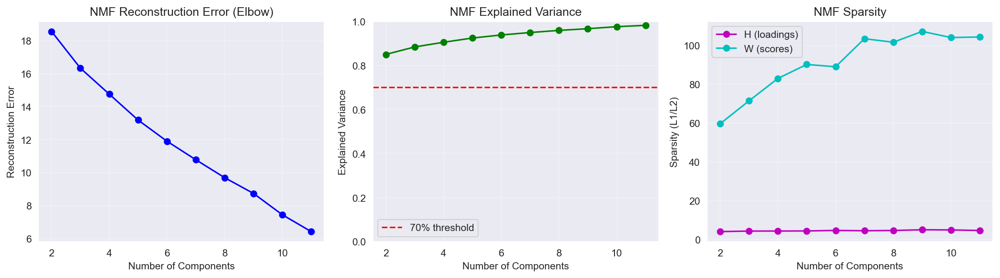
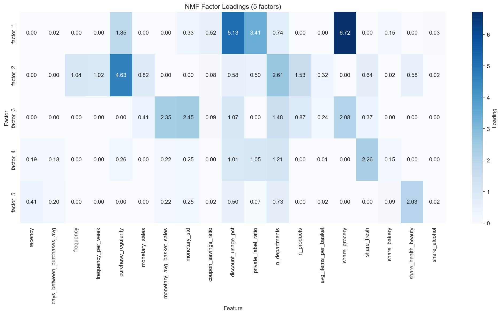
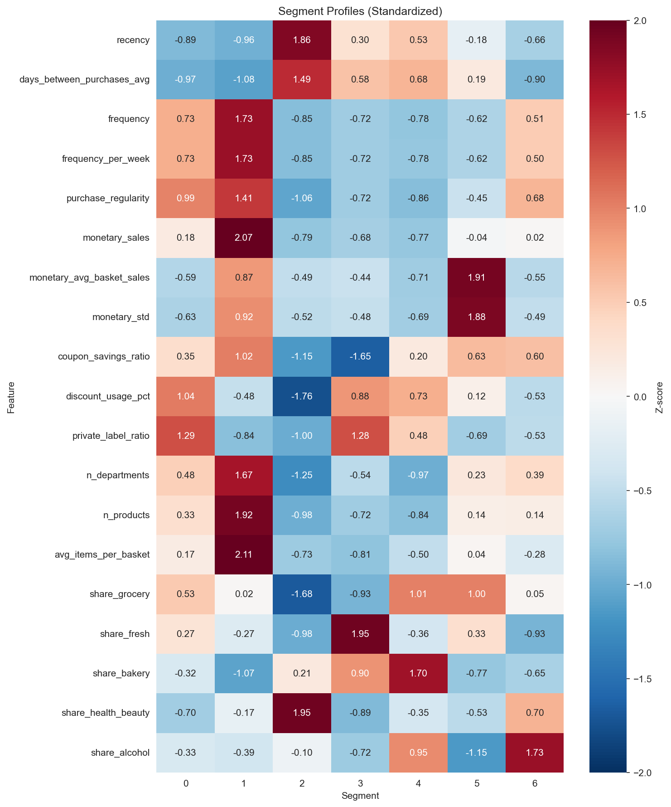
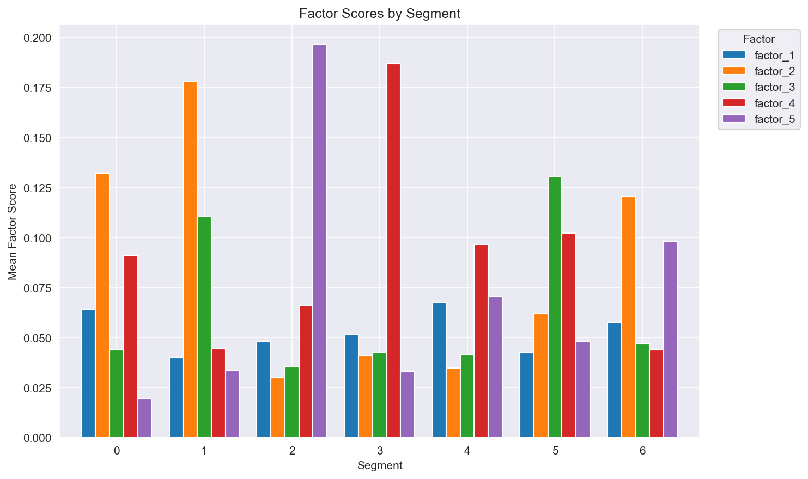
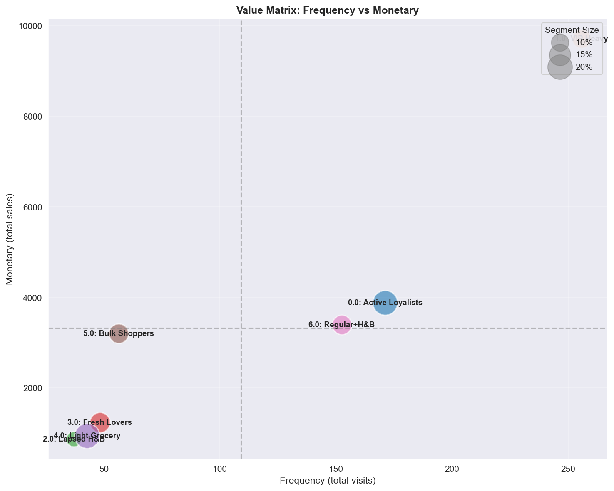
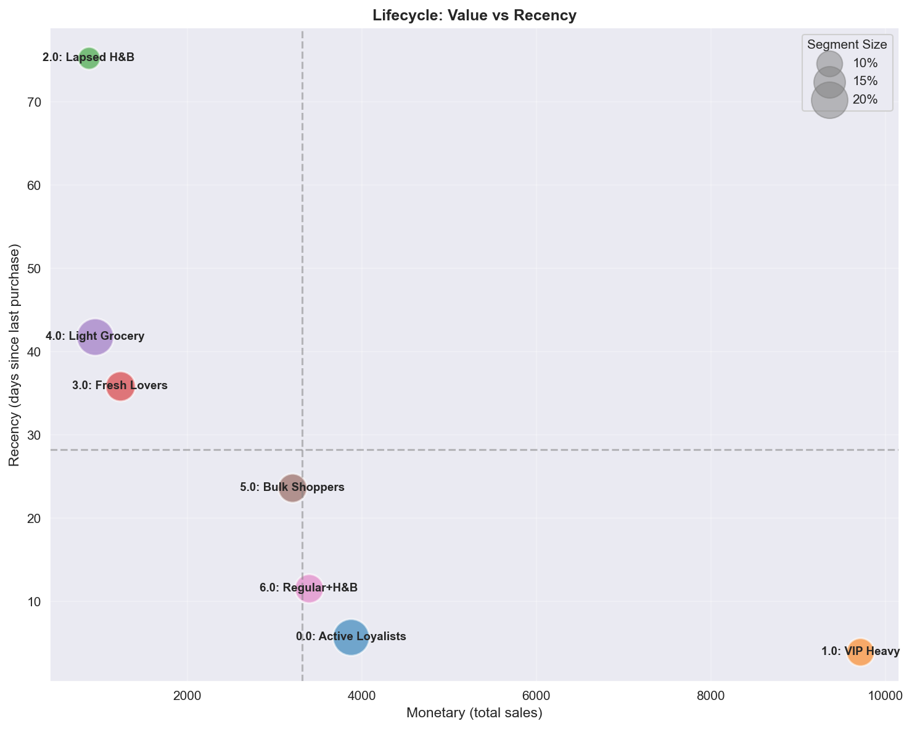
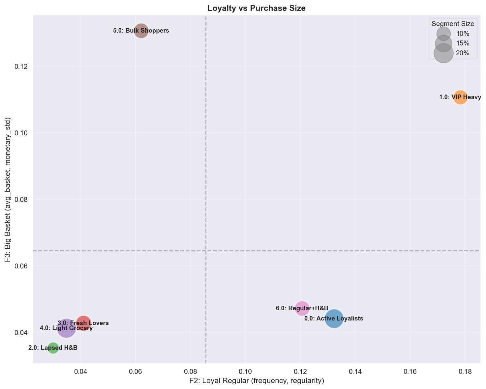
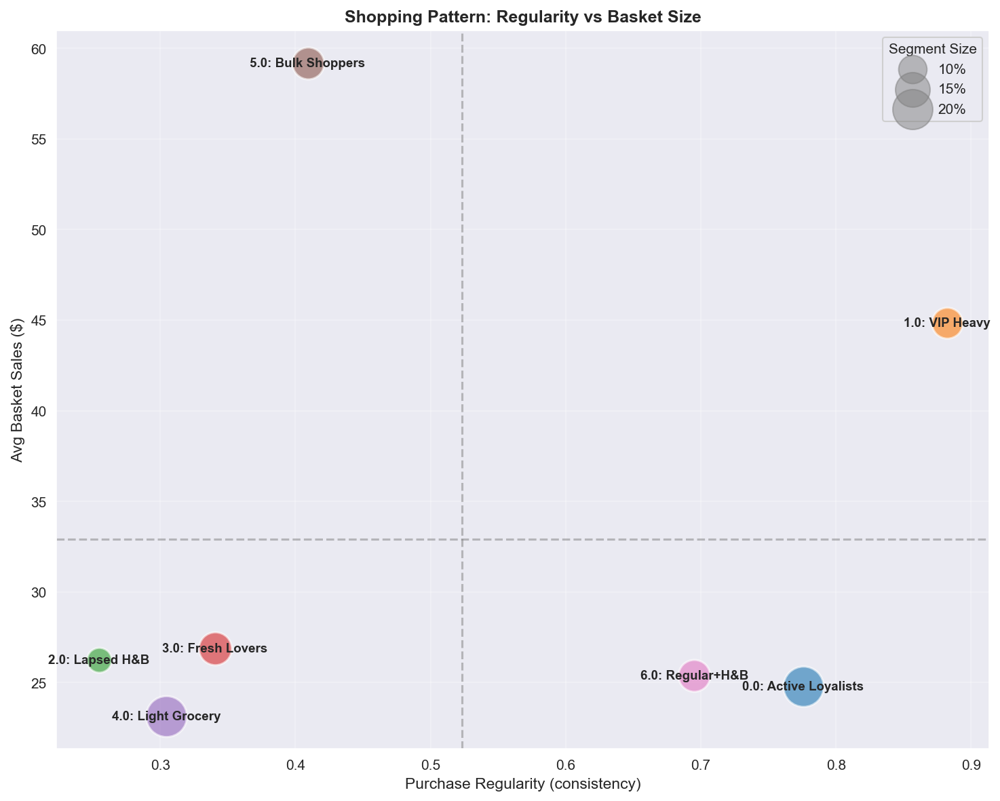
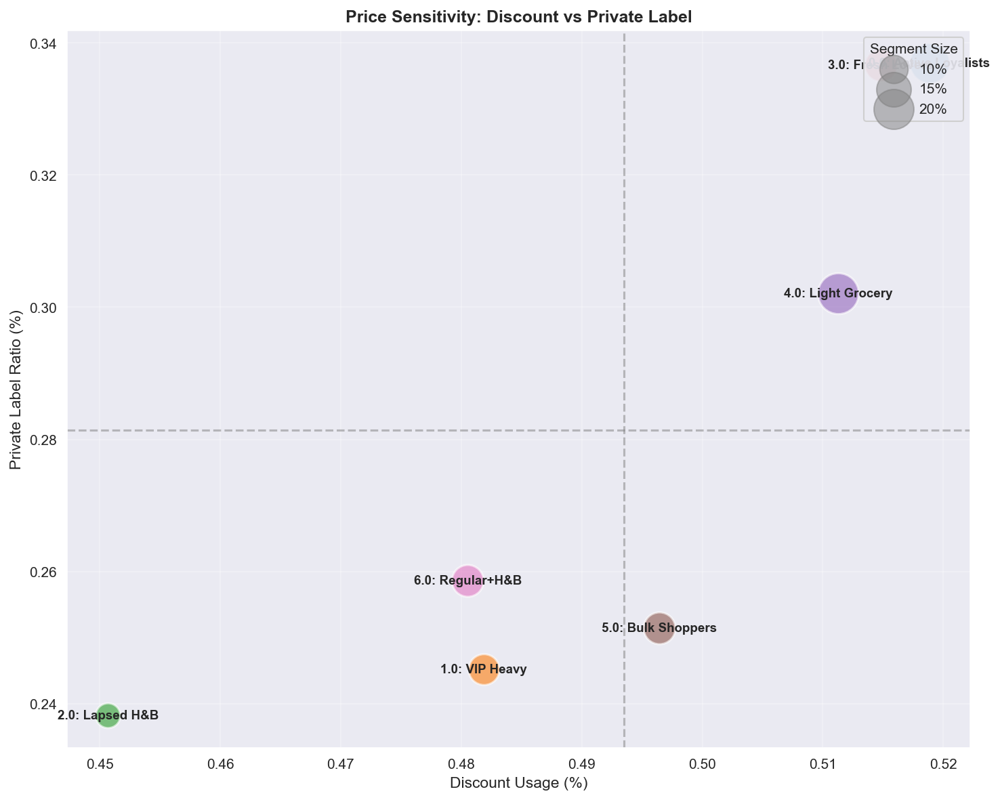
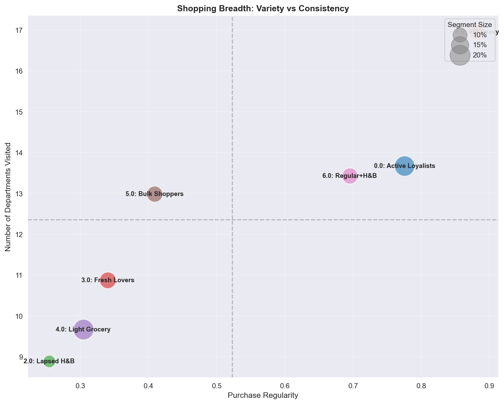

# Latent Factor Modeling을 활용한 고객 세분화: 리테일 분석 사례 연구

## 요약

본 연구는 Dunnhumby "The Complete Journey" 데이터셋의 리테일 거래 데이터를 활용하여 행동 기반 고객 세분화 프레임워크를 제시한다. Non-negative Matrix Factorization (NMF)과 K-Means Clustering을 결합하여 102주 관측 기간 동안 2,500 가구로부터 7개의 고객 세그먼트를 도출하였다.

**주요 결과:**
- 5개의 해석 가능한 Latent Factor가 고객 행동 분산의 92.44%를 설명
- 7개 고객 세그먼트의 높은 안정성 (Bootstrap ARI = 0.77 ± 0.11)
- VIP 세그먼트 (전체의 12%)가 고객당 평균 $9,716 매출 창출
- 고가치 고객군 (44.8%)이 전체 매출의 약 70% 기여
- 각 세그먼트별 명확한 마케팅 전략 도출

본 세분화는 개인화 마케팅 전략의 기반을 제공하며, 후속 Causal Targeting 분석 (Track 2)의 입력으로 활용된다.

---

## 1. 서론

### 1.1 배경

고객 세분화는 현대 리테일 마케팅 전략의 핵심이다. 고객의 행동 패턴을 기반으로 그룹화함으로써, 리테일러는 마케팅 투자 수익률을 극대화하는 타겟 개입을 개발할 수 있다. 전통적인 인구통계 기반 세분화는 구매 결정을 좌우하는 미묘한 행동적 차이를 포착하지 못하는 경우가 많다. 본 연구는 거래 데이터에서 추출한 Feature를 활용하여 자연스러운 고객 그룹을 발견하는 행동 우선 접근법을 채택한다.

### 1.2 데이터셋

본 연구는 **Dunnhumby "The Complete Journey"** 데이터셋을 분석한다:

| 항목 | 값 |
|------|-----|
| 가구 수 | 2,500 |
| 거래 건수 | 260만 건 |
| 분석 기간 | 102주 (2년) |
| 캠페인 수 | 30개 마케팅 캠페인 |
| 상품 수 | 92,000+ SKUs |
| 매장 수 | 400+ 개 |

데이터셋에는 거래 기록, 가구 Demographics (32% 커버리지), 캠페인 타겟팅, 쿠폰 배포 및 Redemption 데이터가 포함된다.

### 1.3 연구 목적

1. 고객 쇼핑 패턴을 특징짓는 **Latent Behavioral Factor 추출**
2. 실행 가능한 마케팅 시사점을 제공하는 **고유한 고객 세그먼트 식별**
3. Bootstrap Resampling을 통한 **세그먼트 안정성 검증**
4. **세그먼트별 마케팅 권고안 개발**

### 1.4 분석 프레임워크

본 분석은 2-Track 연구 프레임워크의 일부이다:

- **Track 1 (본 리포트)**: 기술적 세분화를 통한 Customer Understanding
- **Track 2 (별도)**: Heterogeneous Treatment Effect 추정을 통한 Causal Targeting

Track 1 세그먼트는 Track 2 Causal 분석의 Moderator로 활용되어 세그먼트별 캠페인 최적화를 가능하게 한다.

---

## 2. 방법론

### 2.1 Feature Engineering

거래 데이터로부터 33개의 고객 수준 Feature를 구성하여 6개의 개념적 그룹으로 조직화하였다:

| 그룹 | 개수 | 설명 | 예시 |
|------|------|------|------|
| Recency | 6 | 마지막 구매 이후 시간 | days_since_last, active_last_4w |
| Frequency | 6 | 쇼핑 빈도 패턴 | visits_per_week, purchase_regularity |
| Monetary | 7 | 지출 특성 | total_sales, avg_basket_size, coupon_savings |
| Behavioral | 7 | 쇼핑 행동 | discount_rate, private_label_ratio, n_departments |
| Category | 6 | 카테고리 선호 | share_grocery, share_fresh, share_h&b |
| Time | 1 | Tenure 커버리지 | week_coverage |

다중공선성 문제를 해결하기 위해, 높은 상관관계를 가진 쌍 (r ≥ 0.7)을 제거하여 Feature 셋을 33개에서 **19개로 축소**하였다. 예를 들어, `frequency_per_week`과 `frequency_per_month`는 완전 상관 (r = 1.0)을 보여 하나만 유지하였다.

**전처리:** NMF 호환성을 위해 MinMaxScaler 정규화를 [0, 1] 범위로 적용 (비음수 입력 필요).

### 2.2 Latent Factor Modeling (NMF)

Non-negative Matrix Factorization (NMF)은 고객-Feature 행렬을 두 개의 저차원 행렬로 분해하여 Latent Behavioral Factor를 도출한다.

**모델 선택:**
- n_components: 2-8 범위 평가
- 선택 기준: Reconstruction Error (Elbow Method) 및 Factor 해석가능성
- **선택: 5 Components** (분산의 92.44% 설명)

*Figure 1: NMF Component 선택 - Reconstruction Error와 누적 설명 분산.*

**NMF 파라미터:**
- Solver: Coordinate Descent
- Initialization: Random
- Max iterations: 1,000
- Random state: 재현성을 위해 고정

### 2.3 Clustering

NMF Factor Score에 K-Means Clustering을 적용하여 고객 세그먼트를 식별하였다.

**Clustering 평가:**
- k = 2-11 범위 테스트
- K-Means vs. Gaussian Mixture Model (GMM) 비교
- K-Means가 GMM을 크게 상회 (Silhouette: 0.219 vs. 0.047)

**최적 k 선택:**
- Davies-Bouldin Index: k = 7에서 최소 (DBI = 1.241)
- Silhouette Score: k = 6-8 범위에서 안정적
- **선택: k = 7** (클러스터 품질과 비즈니스 해석가능성의 균형)

*Figure 2: k 값에 따른 Clustering 평가 메트릭.*

### 2.4 안정성 검증

Bootstrap Resampling을 수행하여 세그먼트 안정성을 평가하였다:
- 100회 Bootstrap 반복
- 반복당 80% 샘플 비율
- 메트릭: 원본과 Bootstrap 할당 간 Adjusted Rand Index (ARI)

---

## 3. 결과

### 3.1 Latent Factor 해석

NMF는 고객 행동의 서로 다른 측면을 나타내는 5개의 해석 가능한 Latent Factor를 식별하였다:

| Factor | 명칭 | 상위 Feature (Loading) | 해석 |
|--------|------|----------------------|------|
| **F1** | Grocery Deal Seeker | share_grocery (6.7), discount_pct (5.1), PL_ratio (3.4) | 할인을 추구하는 예산 중시 식료품 구매자 |
| **F2** | Loyal Regular | regularity (4.6), n_dept (2.6), frequency (1.0) | One-stop 쇼핑 고관여 고객 |
| **F3** | Big Basket | monetary_std (2.5), avg_basket (2.4) | 비정기적 대량 구매자 |
| **F4** | Fresh Focused | share_fresh (2.3), n_dept (1.2) | 신선식품 카테고리 전문가 |
| **F5** | Health & Beauty | share_h&b (2.0) | 드럭스토어 유형 구매자 |

*Figure 3: NMF Factor Loadings Heatmap - 각 Latent Factor별 Feature 가중치.*

Factor들은 자연스럽게 **Value 차원** (빈도, 금액을 포착하는 F2, F3)과 **Need 차원** (카테고리 선호를 포착하는 F1, F4, F5)으로 분리된다.

### 3.2 Clustering 평가 메트릭

| 메트릭 | 값 | 해석 |
|--------|-----|------|
| Explained Variance | 92.44% | 높은 Factor 커버리지 |
| Silhouette Score | 0.219 | 행동 데이터로서 적절 |
| Calinski-Harabasz Index | 732.0 | 높은 클러스터 간 분산 |
| Davies-Bouldin Index | 1.241 | 양호한 클러스터 분리 |
| Bootstrap ARI | 0.767 ± 0.113 | 높은 안정성 (95% CI: 0.55-0.99) |

Silhouette Score 0.219는 보통 수준이지만, 고객 특성이 이산적 그룹보다 연속적으로 존재하는 행동 Clustering에서는 일반적인 수치이다.

### 3.3 안정성 검증

Bootstrap Resampling (100회 반복, 80% 샘플)은 **0.767 ± 0.113**의 Adjusted Rand Index를 산출하여 높은 세그먼트 안정성을 나타냈다. ARI 0.70 이상은 일반적으로 강한 일치로 간주되며, 7개 세그먼트 솔루션이 샘플링 변동에 강건함을 확인한다.

### 3.4 7개 고객 세그먼트

Clustering은 7개의 고유한 고객 세그먼트를 식별하였다:

| Seg | 명칭 | 규모 | 평균 매출 | Frequency | Recency | 주요 Factor |
|-----|------|------|----------|-----------|---------|------------|
| **0** | Active Loyalists | 509 (20.4%) | $3,878 | 171회 | 6일 | F2 (Loyal) |
| **1** | VIP Heavy | 299 (12.0%) | $9,716 | 256회 | 4일 | F2 (Loyal) |
| **2** | Lapsed H&B | 193 (7.7%) | $872 | 37회 | 75일 | F5 (H&B) |
| **3** | Fresh Lovers | 339 (13.6%) | $1,233 | 76회 | 12일 | F4 (Fresh) |
| **4** | Light Grocery | 524 (21.0%) | $1,100 | 58회 | 17일 | F4 (Fresh) |
| **5** | Bulk Shoppers | 318 (12.7%) | $3,206 | 56회 | 39일 | F3 (Basket) |
| **6** | Regular + H&B | 318 (12.7%) | $3,393 | 141회 | 9일 | F2 (Loyal) |

*Figure 4: 고객 세그먼트 규모 분포.*

### 3.5 세그먼트 프로필

*Figure 5: 세그먼트별 표준화 Feature 프로필 (Z-scores).*

*Figure 6: 각 고객 세그먼트의 평균 Factor Score.*

**세그먼트 특성:**

**Segment 0: Active Loyalists (20.4%)**
- 높은 구매 규칙성과 다양한 카테고리 쇼핑
- 강한 Private Label 선호 (PL ratio 0.34로 최고)
- 예산 중시이면서 충성도 높은 구매자

**Segment 1: VIP Heavy (12.0%)**
- 모든 RFM 메트릭에서 최고 성과
- 최고 빈도 (256회), 금액 ($9,716), 최저 Recency (4일)
- 평균 1,316개 고유 상품 구매하는 진정한 One-stop 쇼퍼

**Segment 2: Lapsed H&B (7.7%)**
- 최고 Recency (75일) - 실질적으로 이탈
- 전반적 관여도 낮은 H&B 카테고리 전문가
- ROI 불확실한 Win-back 대상

**Segment 3: Fresh Lovers (13.6%)**
- 중간 관여도의 신선식품 카테고리 전문가
- 활성 고객 (12일 Recency)으로 집중된 장바구니

**Segment 4: Light Grocery (21.0%)**
- 고객 수 기준 최대 세그먼트, 고객당 최저 가치
- 약간의 신선식품 선호와 함께 가벼운 관여
- 습관 형성 잠재력이 있는 활성화 기회

**Segment 5: Bulk Shoppers (12.7%)**
- 최고 평균 장바구니 크기 (방문당 $59)
- 낮은 빈도이나 방문당 높은 지출
- 창고형/코스트코 스타일 쇼핑 패턴

**Segment 6: Regular + H&B (12.7%)**
- VIP 전환 잠재력이 있는 2등급 가치 세그먼트
- H&B 집중과 함께 정기적 구매자 (141회)

### 3.6 가치 계층 분포

세그먼트는 자연스럽게 가치 계층으로 분리된다:

| 계층 | 세그먼트 | 고객 비율 | 추정 매출 비중 |
|------|----------|----------|---------------|
| **High** | 0, 1, 6 | 44.8% | ~70% |
| **Medium** | 3, 5 | 26.3% | ~20% |
| **Low/At-Risk** | 2, 4 | 28.7% | ~10% |

### 3.7 다차원 세그먼트 포지셔닝

*Figure 7: Loyalty (F2) vs Deal-Seeking (F1) 차원에서의 세그먼트 포지셔닝.*

*Figure 8: VIP 우위와 세그먼트 차별화를 보여주는 RFM 가치 포지셔닝.*

*Figure 9: Active High-value와 Lapsed 세그먼트를 식별하는 고객 라이프사이클 포지셔닝.*

---

## 4. 논의

### 4.1 주요 인사이트

**1. 명확한 가치 계층**
세분화는 명확한 Pareto 분포를 보여준다: 고가치 세그먼트의 44.8%가 추정 매출의 약 70%를 기여한다. VIP Heavy (12%)만으로도 가장 중요한 유지 대상이다.

**2. 행동적 차별화**
Factor들은 **Value** (빈도, 금액)와 **Need** (카테고리 선호) 차원 모두에서 고객을 성공적으로 분리한다. 이 이중 구조는 가치 기반 우선순위 설정과 Need 기반 개인화를 모두 가능하게 한다.

**3. 라이프사이클 단계**
세그먼트는 고유한 라이프사이클 단계에 매핑된다:
- Active/Growing: Segment 0, 1, 6 (낮은 Recency, 높은 관여)
- Stable: Segment 3, 4 (중간 Recency)
- Declining/Churned: Segment 2 (높은 Recency, 낮은 관여)

**4. 카테고리 전문가**
Fresh Lovers (13.6%)와 H&B 집중 세그먼트는 카테고리 전문화를 보여주며, 카테고리별 마케팅 접근 기회를 시사한다.

### 4.2 마케팅 권고안

| 세그먼트 | 우선순위 | 전략 | 주요 액션 |
|----------|----------|------|----------|
| VIP Heavy | High | Retention | 프리미엄 혜택, Churn 예측 알림, 독점 접근 |
| Active Loyalists | High | Strengthen | Private Label 프로모션, 로열티 포인트, 장바구니 확대 |
| Regular + H&B | Medium | Upgrade | VIP 전환 프로그램, Cross-category 인센티브 |
| Bulk Shoppers | Medium | Regularize | 구독 제안, 정기 배송, 번들 딜 |
| Fresh Lovers | Medium | Engage | 신선식품 콘텐츠 마케팅, 일일 특가, 레시피 영감 |
| Light Grocery | Low | Activate | 습관 형성 캠페인, 점진적 보상, 온보딩 |
| Lapsed H&B | Low | Win-back | 재관여 캠페인, H&B 집중 오퍼 |

**권장 예산 배분:**
- High Priority (60%): VIP Heavy (25%), Active Loyalists (20%), Regular + H&B (15%)
- Medium Priority (30%): Bulk Shoppers (10%), Fresh Lovers (10%), Light Grocery (10%)
- Low Priority (10%): Lapsed H&B (10%)

### 4.3 한계점

**1. 보통 수준의 Silhouette Score (0.219)**
행동 데이터는 본질적으로 이산적 경계보다 연속성을 보인다. 이 점수는 고객 세분화에서 수용 가능하나 세그먼트 간 일부 중첩을 나타낸다.

**2. 제한된 Demographics 커버리지 (32%)**
2,500 가구 중 801 가구만 인구통계 정보를 보유하여, Demographics 기반 층화와 페르소나 개발이 제한된다.

**3. 기술적 vs. 인과적**
본 세분화는 기술적(Descriptive)이다. "어떤 세그먼트가 프로모션에 가장 잘 반응하는가?"와 같은 질문은 Causal 분석 (Track 2)이 필요하다.

**4. 단일 리테일러 맥락**
결과는 이 리테일러의 고객 베이스에 특화되어 있으며 다른 리테일 맥락으로 일반화되지 않을 수 있다.

### 4.4 향후 방향

**1. Track 2 통합**
세그먼트는 Track 2 Causal 분석에서 Heterogeneous Treatment Effect Moderator로 활용될 것이다. 이는 세그먼트별 캠페인 효과 추정을 가능하게 한다.

**2. A/B Testing 검증**
권장 전략은 전면 배포 전 통제 실험을 통해 검증되어야 한다.

**3. Dynamic 세분화**
세그먼트 이동과 진화하는 고객 행동을 포착하기 위한 정기적 재-Clustering.

**4. Value × Need 프레임워크**
Cross-sell 최적화 시나리오를 위해 별도의 Value (RFM)와 Need (Category) Factor 모델을 사용하는 선택적 확장.

---

## 5. 결론

본 연구는 Latent Factor Modeling과 Clustering을 활용한 행동 기반 고객 세분화의 효과적인 접근법을 보여준다. NMF + K-Means 프레임워크는 높은 안정성 (ARI = 0.77)과 명확한 비즈니스 해석가능성을 가진 7개의 고유한 고객 세그먼트를 성공적으로 식별하였다.

주요 성과:
- Value (Loyalty, Monetary)와 Need (Category Preference) 차원을 포착하는 **5개 Latent Factor**
- VIP Heavy ($9,716 평균)부터 Lapsed H&B ($872 평균)까지 다양한 **7개 실행 가능한 세그먼트**
- 집중적인 유지 노력이 필요한 44.8% 고가치 고객을 포함한 **명확한 우선순위 계층**
- Retention (VIP)에서 Activation (Light Grocery), Win-back (Lapsed)까지의 **세그먼트별 전략**

세분화는 개인화 마케팅의 견고한 기반을 제공하며, 후속 Causal Targeting 분석의 입력으로 활용되어 증거 기반 마케팅 최적화를 가능하게 한다.

---

## 부록: 기술적 세부사항

### A.1 소프트웨어 환경
- Python 3.9+
- scikit-learn (NMF, K-Means)
- pandas, numpy (데이터 처리)
- matplotlib, seaborn (시각화)

### A.2 재현성
- 모든 확률적 프로세스에 Random Seed 고정
- 프로젝트 노트북에서 전체 코드 확인 가능:
  - `01_feature_engineering.ipynb`
  - `02_customer_profiling.ipynb`

### A.3 데이터 산출물
- 세그먼트 할당: `data/dunnhumby/processed/segment_models.joblib`
- Feature 메타데이터: `data/dunnhumby/processed/feature_metadata.json`

### A.4 세그먼트 포지셔닝 분석: Bubble Chart별 마케팅 액션

본 섹션은 각 2차원 세그먼트 포지셔닝 차트에 대한 상세 마케팅 해석을 제공한다.

---

#### A.4.1 Loyalty (F2) vs Deal-Seeking (F1)

| 사분면 | 세그먼트 | 프로필 | 마케팅 액션 |
|--------|----------|--------|------------|
| **High Loyalty + High Deal** | Active Loyalists | 충성도 높지만 가격 민감 | PB 프로모션, 할인 트리거 연동 로열티 포인트 |
| **High Loyalty + Low Deal** | VIP Heavy | 프리미엄 충성 고객 | 독점 접근, 프리미엄 서비스, 할인 지양 |
| **Low Loyalty + High Deal** | Light Grocery, Fresh Lovers | Cherry-picker | 점진적 보상으로 충성도 전환 |
| **Low Loyalty + Low Deal** | Lapsed H&B, Bulk Shoppers | 이탈 또는 거래적 관계 | Win-back 또는 낮은 관여 수용 |

---

#### A.4.2 Loyalty (F2) vs Big Basket (F3)

| 사분면 | 세그먼트 | 프로필 | 마케팅 액션 |
|--------|----------|--------|------------|
| **High Loyalty + High Basket** | VIP Heavy | One-stop 파워 쇼퍼 | Retention 집중, 개인화 추천 |
| **High Loyalty + Low Basket** | Active Loyalists, Regular+H&B | 빈번한 소규모 장바구니 | Cross-sell, 번들 오퍼로 장바구니 확대 |
| **Low Loyalty + High Basket** | Bulk Shoppers | 비정기적 대량 구매 | 구독 모델, 정기 배송 인센티브 |
| **Low Loyalty + Low Basket** | Lapsed, Light Grocery | 최소 관여 | 활성화 캠페인, 습관 형성 |

---

#### A.4.3 Fresh (F4) vs Health & Beauty (F5)

| 사분면 | 세그먼트 | 프로필 | 마케팅 액션 |
|--------|----------|--------|------------|
| **High Fresh + Low H&B** | Fresh Lovers | 요리/건강 중시 | 레시피 콘텐츠, Farm-to-store 스토리, 일일 신선 특가 |
| **Low Fresh + High H&B** | Lapsed H&B, Regular+H&B | 드럭스토어 니즈 | H&B 샘플링, 뷰티 멤버십, 건강 구독 |
| **균형** | VIP Heavy, Active Loyalists | 전체 장바구니 쇼퍼 | Cross-category 프로모션, One-stop 편의 |
| **Low Both** | Light Grocery, Bulk | 필수품 중심 | 카테고리 확장 인센티브 |

---

#### A.4.4 Frequency vs Monetary (RFM 핵심)

| 사분면 | 세그먼트 | 프로필 | 마케팅 액션 |
|--------|----------|--------|------------|
| **High Freq + High Monetary** | VIP Heavy | 최고 고객 | 어떤 비용을 치르더라도 보호, 프리미엄 대우 |
| **High Freq + Low Monetary** | Active Loyalists | 빈번한 소액 지출자 | 장바구니 크기 확대, Upselling |
| **Low Freq + High Monetary** | Bulk Shoppers | 창고형 스타일 | 방문 빈도 증가, 구독 |
| **Low Freq + Low Monetary** | Lapsed, Light Grocery | At-risk/휴면 | Win-back ROI 평가용 세분화 |

---

#### A.4.5 Regularity vs Average Basket Size

| 사분면 | 세그먼트 | 프로필 | 마케팅 액션 |
|--------|----------|--------|------------|
| **High Regularity + High Basket** | VIP Heavy | 예측 가능한 고가치 | 리듬 유지, 니즈 예측 |
| **High Regularity + Low Basket** | Active Loyalists | 일관된 소규모 방문 | Top-up에서 Stock-up으로 전환 |
| **Low Regularity + High Basket** | Bulk Shoppers | 산발적 대량 쇼핑 | 리마인더, 자동 보충으로 정기화 |
| **Low Regularity + Low Basket** | Lapsed, Light | 예측 불가 저가치 | 수용 또는 타겟 재활성화 |

---

#### A.4.6 Recency vs Monetary (라이프사이클)

| 사분면 | 세그먼트 | 프로필 | 마케팅 액션 |
|--------|----------|--------|------------|
| **Low Recency + High Monetary** | VIP Heavy, Active Loyalists | 활성 고가치 | Retention, Churn 신호 방지 |
| **Low Recency + Low Monetary** | Fresh Lovers, Light Grocery | 활성 저가치 | Cross-sell로 가치 성장 |
| **High Recency + High Monetary** | (드묾) | 최근 이탈한 VIP | 프리미엄 오퍼로 긴급 Win-back |
| **High Recency + Low Monetary** | Lapsed H&B | 이탈한 저가치 | 저우선 Win-back, Churn 수용 |

---

#### A.4.7 Discount Rate vs Private Label Ratio

| 사분면 | 세그먼트 | 프로필 | 마케팅 액션 |
|--------|----------|--------|------------|
| **High Discount + High PL** | Active Loyalists | 예산 극대화자 | PB 중심 프로모션, 가치 메시징 |
| **High Discount + Low PL** | Fresh Lovers | 브랜드 충성 할인 추구자 | NB 프로모션, PB 체험 인센티브 |
| **Low Discount + High PL** | Regular+H&B | 품질 추구 PB 팬 | 프리미엄 PB 라인, 신규 PB 출시 |
| **Low Discount + Low PL** | VIP Heavy, Bulk | 가격 무관심 | 할인 지양, 편의/품질에 집중 |

---

#### A.4.8 Shopping Variety vs Regularity

| 사분면 | 세그먼트 | 프로필 | 마케팅 액션 |
|--------|----------|--------|------------|
| **High Variety + High Regularity** | VIP Heavy | 궁극의 One-stop 쇼퍼 | 전체 개인화, Category Captain |
| **High Variety + Low Regularity** | Bulk Shoppers | 가끔의 종합 쇼핑 | 정기적 케이던스로 전환 |
| **Low Variety + High Regularity** | Fresh Lovers | 카테고리 전문가 | 카테고리 심화, 인접 확장 |
| **Low Variety + Low Regularity** | Lapsed, Light | 협소, 비정기 | 장바구니 확대 먼저, 그 다음 빈도 |
