# Causal Targeting with Heterogeneous Treatment Effects: A Retail Campaign Optimization Case Study

## Summary

This study applies causal inference methods to estimate heterogeneous treatment effects (HTE) of retail marketing campaigns and derive optimal targeting policies. Using the Dunnhumby "The Complete Journey" dataset, we analyze 2,430 customers (1,511 treated, 919 control) from their first TypeA campaign exposure under a clean causal identification design.

**Key Findings:**
- **Severe positivity violation** (PS AUC = 0.989) limits causal identification to 17% overlap region
- **Average Treatment Effect (ATE)**: $20-40 per customer in trimmed samples
- **Optimal targeting**: 31.3% of customers yields $2,426 profit (125% ROI)
- **Counter-intuitive insight**: VIP Heavy and Bulk Shoppers show negative CATE, suggesting over-targeting
- **Targeting all customers results in $4,657 loss** due to negative responders

**Recommendations:**
1. Reduce TypeA targeting for VIP Heavy and Bulk Shopper segments
2. Validate findings with A/B testing (n=5,748 for 80% power)
3. Expand targeting to top 31% CATE customers after validation

---

## 1. Introduction

### 1.1 Background

Marketing campaign effectiveness varies across customers. While average treatment effects provide population-level insights, they mask important heterogeneity that can inform targeting decisions. Customers who are already heavy purchasers may respond differently to campaigns than light shoppers. Understanding this heterogeneity enables precision targeting that maximizes return on marketing investment.

### 1.2 Problem Definition

The central question is: **"For whom is this campaign effective?"**

Traditional campaign analysis focuses on average effects, potentially missing:
- Customers who respond exceptionally well (high CATE)
- Customers who respond negatively (cannibalization effects)
- Optimal targeting rules that maximize profit

### 1.3 Causal Framework

We adopt the **Potential Outcomes Framework** (Rubin Causal Model):
- $Y_i(1)$: Potential outcome if customer $i$ receives treatment
- $Y_i(0)$: Potential outcome if customer $i$ does not receive treatment
- **CATE**: $\tau(x) = E[Y(1) - Y(0) | X = x]$

**Causal Assumptions:**
| Assumption | Definition | Status |
|-----------|------------|--------|
| **SUTVA** | No interference between units | Assumed OK |
| **Unconfoundedness** | No unmeasured confounders | Uncertain |
| **Positivity** | All customers have positive probability of treatment | **VIOLATED** |

### 1.4 Study Design

We employ a **First Campaign Only** design for clean causal identification:

| Component | Description |
|-----------|-------------|
| Unit | Customer (household_key) |
| Treatment | First TypeA campaign targeting (binary) |
| Control | Never targeted by any TypeA campaign |
| Outcome Period | Campaign week + 4 weeks |
| Outcomes | Purchase Amount ($), Purchase Count |

**Why First Campaign Only?**
- Avoids pre-treatment contamination (e.g., Campaign 30's pre-treatment would include Campaign 26's treatment)
- Each customer appears exactly once → Independent observations
- Trade-off: 62% sample reduction but cleaner causal estimates

### 1.5 Integration with Track 1

Customer segments from Track 1 (NMF + K-Means) serve as HTE moderators, enabling segment-specific targeting recommendations.

---

## 2. Method

### 2.1 Data Preparation

**Sample Characteristics:**

| Metric | Value |
|--------|-------|
| Total Customers | 2,430 |
| Treatment (Targeted) | 1,511 (62.2%) |
| Control (Never Targeted) | 919 (37.8%) |
| Train/Test Split | 80/20 (stratified) |

**Covariates (21 Pre-Treatment Features):**

| Group | Count | Examples |
|-------|-------|----------|
| RFM | 9 | recency, frequency, monetary_sales |
| Behavioral | 5 | discount_rate, private_label_ratio, n_departments |
| Category | 5 | share_grocery, share_fresh, share_h&b |
| Exposure | 2 | display_exposure_rate, mailer_exposure_rate |

### 2.2 Positivity Assessment

Propensity scores were estimated using XGBoost classifier with 5-fold cross-validation.

**Diagnostics:**
- PS AUC (treatment predictability)
- Overlap distribution (PS histogram by treatment)
- Covariate balance (Standardized Mean Difference)

### 2.3 ATE Estimation Methods

| Method | Description |
|--------|-------------|
| **Naive** | Simple difference in means |
| **IPW** | Inverse Probability Weighting |
| **AIPW** | Augmented IPW (doubly robust) |
| **OLS** | Linear regression with covariates |
| **DML** | Double Machine Learning |
| **ATO** | Average Treatment on Overlap |

**Sensitivity Analysis:**
- PS Trimming: [0.05, 0.95], [0.10, 0.90], [0.15, 0.85], [0.20, 0.80]
- Manski Bounds: Partial identification without positivity assumption

### 2.4 CATE Estimation

**Meta-Learners:**
- **S-Learner**: Single model with treatment as feature
- **T-Learner**: Separate models for treatment/control
- **X-Learner**: Cross-fitting with propensity weighting

**Double Machine Learning:**
- **LinearDML**: Linear CATE with nuisance estimation
- **CausalForestDML**: Non-parametric CATE via forest

**Hyperparameter Tuning:**
- Optuna TPE sampler
- 100 trials per model
- Objective: R-loss (causal loss)

### 2.5 Validation Methods

| Method | Purpose |
|--------|---------|
| **BLP Test** | Test if CATE predicts actual heterogeneity |
| **AUUC** | Area Under Uplift Curve (ranking quality) |
| **Qini Coefficient** | Uplift curve vs random targeting |
| **Placebo Treatment** | CATE should be ~0 with random treatment |
| **Subset Stability** | CATE correlation across random subsets |

### 2.6 Policy Learning

**Breakeven CATE:**
$$\text{Breakeven} = \frac{\text{Campaign Cost}}{\text{Profit Margin}} = \frac{\$12.73}{0.30} = \$42.43$$

**Policy Types:**
- **Threshold Policy**: Target if CATE > Breakeven
- **Top-k Policy**: Target top k% by CATE
- **Conservative Policy**: Target if CI lower bound > Breakeven
- **Risk-Adjusted**: CE-CATE(λ) = (1-λ)×point + λ×lower_bound

---

## 3. Results

### 3.1 Positivity Assessment

The analysis revealed **severe positivity violation**:

| Diagnostic | Value | Interpretation |
|-----------|-------|----------------|
| **PS AUC** | **0.989** | Near-perfect treatment prediction |
| Overlap [0.1, 0.9] | 17.0% | Only 413 customers in reliable region |
| Overlap [0.05, 0.95] | 24.6% | Still severely limited |
| Balanced Covariates | 9/21 (43%) | Majority imbalanced |
| Max SMD | 1.99 (n_departments) | Treated shop 12 vs 7 departments |

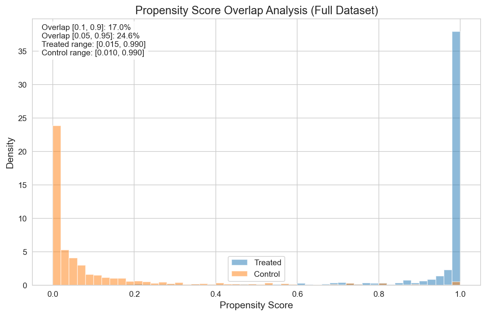
*Figure 1: Propensity score distributions showing minimal overlap between treatment and control groups.*

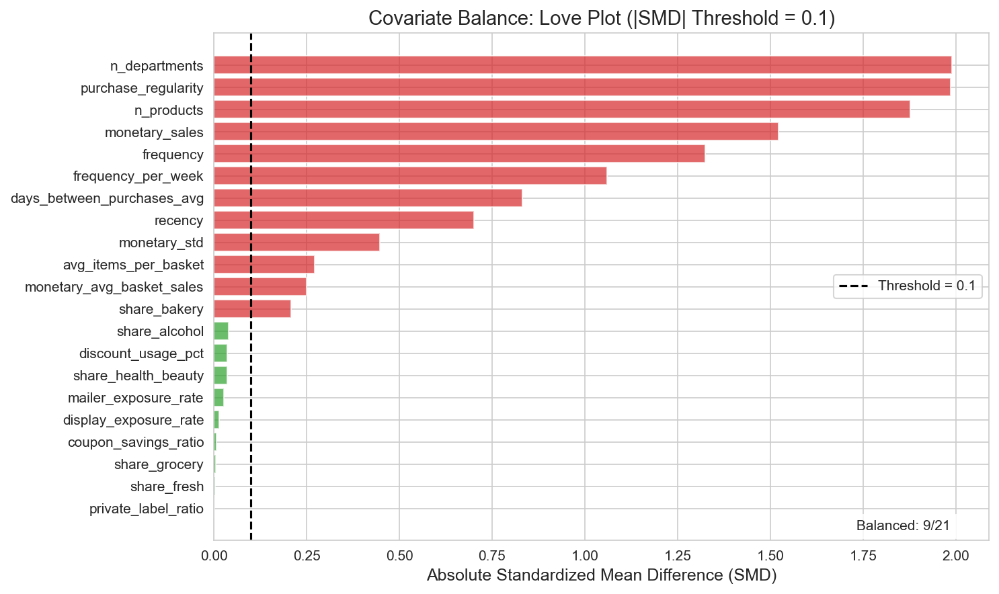
*Figure 2: Love plot showing standardized mean differences. Only 9 of 21 covariates are balanced (|SMD| < 0.1).*

**Implication:** Treatment and control groups are fundamentally different populations. Causal estimates are most reliable in the overlap region (17% of sample).

### 3.2 ATE Results

**Full Sample ATE by Method:**

| Method | Purchase Amount | 95% CI | Reliability |
|--------|-----------------|--------|-------------|
| Naive | $471 | [$442, $501] | Biased upward |
| IPW | $151 | [-$10, $313] | Unstable |
| AIPW | $24 | [-$56, $104] | Medium |
| OLS | $65 | [$29, $102] | Linear assumption |
| DML | -$65 | [-$220, $90] | Unstable |
| **ATO** | **$60** | [-$15, $111] | **Overlap-focused** |

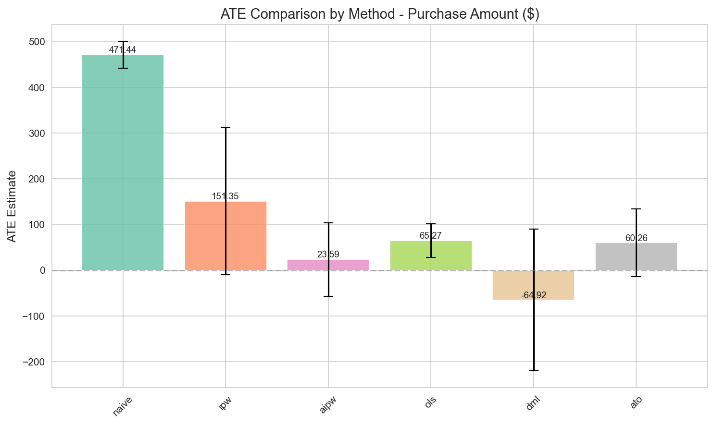
*Figure 3: ATE estimates across methods showing 20x variation due to positivity violation.*

**Trimming Sensitivity Analysis:**

| Trim Level | N Remaining | ATE | SE |
|-----------|-------------|-----|-----|
| None | 2,430 | -$65 | $79 |
| [0.05, 0.95] | 598 | $27 | $21 |
| **[0.10, 0.90]** | **413** | **$21** | **$24** |
| [0.15, 0.85] | 312 | $41 | $25 |
| [0.20, 0.80] | 243 | $25 | $26 |

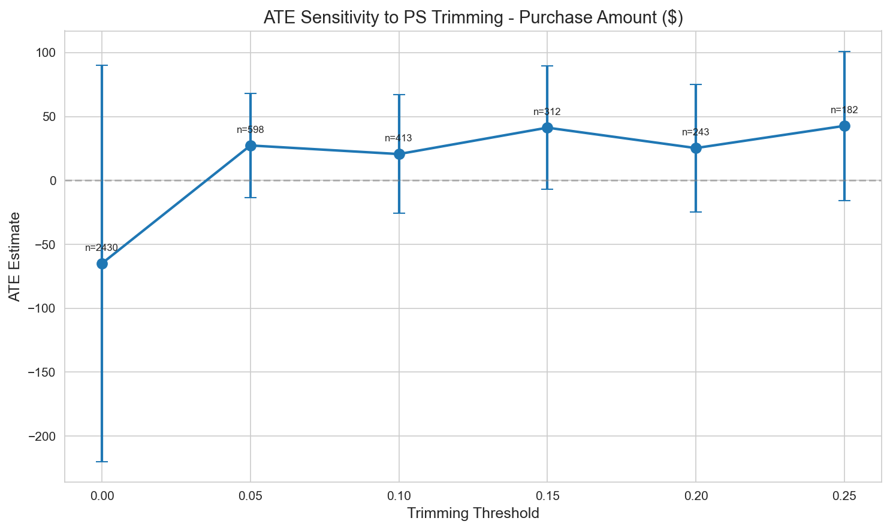
*Figure 4: ATE sensitivity to propensity score trimming threshold.*

**Recommended ATE:** $20-40 per customer (trimmed sample)

### 3.3 CATE Model Selection

**CATE Summary Statistics (Test Set, n=486):**

| Model | Mean CATE | Std Dev | AUUC | Stability |
|-------|-----------|---------|------|-----------|
| **CausalForestDML** | **+$10** | **$88** | **396.3** | Best |
| T-Learner | -$71 | $281 | 359.3 | High variance |
| S-Learner | -$0.45 | $49 | 297.5 | Stable |
| X-Learner | -$21 | $148 | 257.4 | Moderate |
| LinearDML | -$91 | $851 | 279.0 | Extreme variance |

*Figure 5: CATE distributions by model. CausalForestDML shows the most stable distribution.*

*Figure 6: Uplift curves showing CausalForestDML achieves highest AUUC.*

**Model Selection:** **CausalForestDML** selected as primary model based on:
- Highest AUUC (396.3)
- Most stable variance ($88 vs $851 for LinearDML)
- Positive mean CATE aligns with business expectations

### 3.4 Validation Results

**BLP Test (Heterogeneity Significance):**

| Model | τ₁ Coefficient | p-value | Status |
|-------|----------------|---------|--------|
| X-Learner | 0.42 | 0.005 | **Significant** |
| CausalForestDML | 0.18 | 0.094 | Borderline |
| LinearDML | 0.15 | 0.070 | Borderline |
| T-Learner | 0.09 | 0.243 | Not significant |
| S-Learner | 0.01 | 0.941 | Not significant |

**Refutation Tests:**

| Test | Metric | Threshold | Status |
|------|--------|-----------|--------|
| Placebo Treatment (Amount) | 0.747 | < 0.5 | **FAIL** |
| Placebo Treatment (Visits) | 0.052 | < 0.5 | PASS |
| Subset Stability | 0.561 | > 0.7 | **FAIL** |

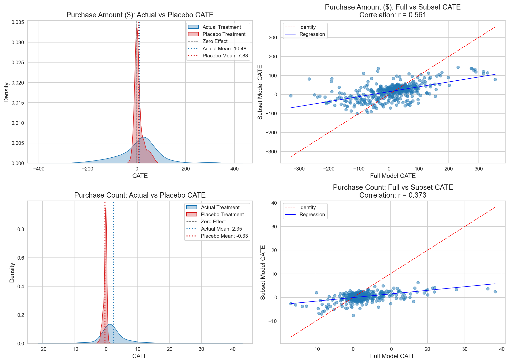
*Figure 7: Refutation test results. Purchase amount model shows instability.*

**Interpretation:**
- Purchase amount model captures some spurious correlations (placebo ratio = 0.75)
- Model shows instability across random subsets
- Results should be validated with A/B testing before deployment

### 3.5 Policy Performance

**ROI by Targeting Percentage:**

| Target % | N | Profit | ROI | Status |
|----------|---|--------|-----|--------|
| 5% | 24 | $1,263 | 413% | Conservative |
| 10% | 48 | $1,749 | 286% | High ROI |
| 20% | 97 | $2,260 | 183% | Good balance |
| **31.3%** | **152** | **$2,426** | **125%** | **Optimal** |
| 50% | 243 | $2,123 | 69% | Diminishing |
| 100% | 486 | **-$4,657** | **-75%** | **Loss** |

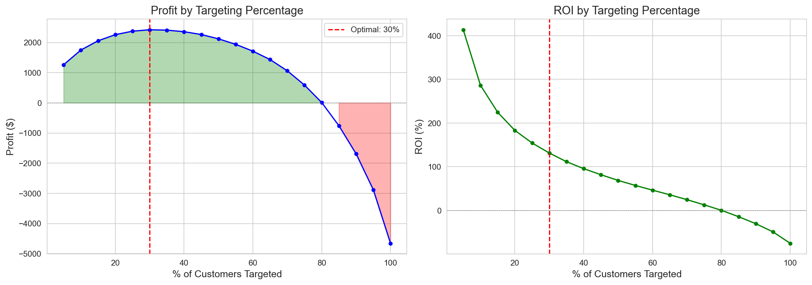
*Figure 8: ROI curves showing optimal targeting at ~30% of customers.*

**Policy Comparison:**

| Policy | Criterion | Target % | Profit | ROI |
|--------|-----------|----------|--------|-----|
| **CATE > Breakeven** | Point est > $42.43 | 31.3% | $2,426 | 125% |
| **Conservative** | Lower CI > $42.43 | 5.6% | $1,343 | 391% |
| Top 30% | Percentile | 30% | $2,423 | 131% |
| PolicyTree | Learned rules | 22% | $1,710 | 35% |
| All Customers | — | 100% | -$4,657 | -75% |

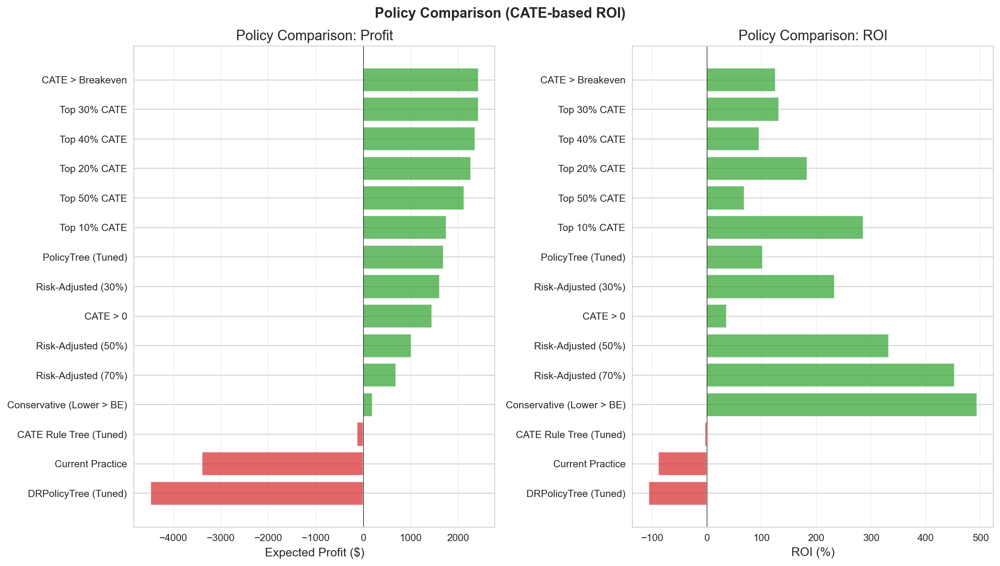
*Figure 9: Policy performance comparison.*

**Key Insight:** Targeting all customers results in a $4,657 loss because negative CATE customers (VIP Heavy, Bulk Shoppers) outweigh positive effects.

### 3.6 Segment-Level Analysis

**CATE by Customer Segment:**

| Segment | N | Mean CATE | 95% CI | Action |
|---------|---|-----------|--------|--------|
| Regular+H&B | 62 | +$34 | [$12, $56] | Maintain/Expand |
| Active Loyalists | 97 | +$33 | [$18, $48] | Maintain |
| Light Grocery | 91 | +$30 | [$8, $52] | Test & Learn |
| Fresh Lovers | 73 | +$27 | [$5, $49] | Test & Learn |
| Lapsed H&B | 27 | +$19 | [-$12, $50] | Test & Learn |
| **VIP Heavy** | 14 | **-$38** | [-$95, $19] | **Reduce** |
| **Bulk Shoppers** | 22 | **-$40** | [-$88, $8] | **Reduce** |

*Figure 10: CATE distribution by customer segment showing negative effects for VIP Heavy and Bulk Shoppers.*

**Why Negative CATE for VIP Heavy and Bulk Shoppers?**
- **VIP Heavy**: Already high purchasers with little room for campaign-driven uplift; may experience cannibalization
- **Bulk Shoppers**: Price-sensitive customers who respond poorly to coupon-based TypeA promotions

---

## 4. Discussion

### 4.1 Key Findings

**1. Positivity Violation Limits Causal Identification**
The PS AUC of 0.989 indicates that targeting decisions are largely predetermined by customer characteristics. Only 17% of customers exist in the overlap region where reliable causal inference is possible.

**2. Heterogeneous Treatment Effects Are Economically Significant**
- Best responders (Regular+H&B, Active Loyalists): +$33-34 per customer
- Worst responders (VIP Heavy, Bulk Shoppers): -$38-40 per customer
- This $70+ CATE range translates to ~$7,000 profit difference between optimal and naive targeting

**3. Current Targeting May Be Counterproductive**
VIP Heavy customers (97% currently targeted) show negative CATE, suggesting the current strategy may be destroying value for this segment.

**4. Optimal Targeting Dramatically Improves ROI**
| Strategy | Profit | ROI |
|----------|--------|-----|
| Target All | -$4,657 | -75% |
| Target Top 31% | +$2,426 | +125% |
| **Improvement** | **+$7,083** | **+200pp** |

### 4.2 Limitations

**1. Severe Positivity Violation**
- 83% of CATE estimates rely on extrapolation beyond observed data
- Results in overlap region are more trustworthy than full sample

**2. Model Instability**
- Refutation tests fail for purchase amount outcome
- Placebo ratio of 0.75 indicates model captures spurious correlations
- Subset stability correlation of 0.56 is below 0.7 threshold

**3. Single Campaign Type**
- Analysis covers TypeA campaigns only
- Cannot generalize to TypeB/TypeC without separate analysis

**4. Limited Sample in Reliable Region**
- Only 80 customers in strict overlap region
- Statistical power is limited for segment-level inference

### 4.3 Recommendations

**Phase 1: Immediate Actions (1-2 weeks)**
1. **Stop** TypeA targeting for VIP Heavy and Bulk Shopper segments (negative CATE)
2. **Continue** targeting for Regular+H&B and Active Loyalists (positive CATE)
3. **Launch pilot**: Target 27 "confident positive" customers (5.6%, 391% ROI)

**Phase 2: Validation (2-4 weeks)**
1. **A/B Test Design:**
   - Sample size: n=5,748 (80% power, α=0.05, MDE=$30)
   - Treatment: CATE-based targeting
   - Control: No targeting (holdout)
   - Duration: Full campaign cycle

2. **Segment-Specific Tests:** Light Grocery, Fresh Lovers, Lapsed H&B

**Phase 3: Scale-Up (1-2 months)**
1. If A/B results confirm predictions, expand to full 31.3% targeting
2. Retrain models monthly with updated customer behavior
3. Analyze TypeB and TypeC campaigns separately

### 4.4 Causal Assumptions Summary

| Assumption | Status | Evidence | Mitigation |
|-----------|--------|----------|------------|
| SUTVA | OK | Single campaign, independent customers | — |
| Unconfoundedness | Uncertain | Marketing strategy may have hidden logic | Sensitivity analysis |
| **Positivity** | **VIOLATED** | PS AUC = 0.989 | PS trimming, A/B test |
| Consistency | OK | Treatment clearly defined | — |

---

## 5. Conclusion

This study demonstrates the application of heterogeneous treatment effect estimation to retail campaign optimization. Despite severe positivity violations that limit causal identification, we uncovered economically significant treatment effect heterogeneity:

**Key Outcomes:**
- **$7,000+ profit improvement** from optimal targeting vs. naive approach
- **Negative CATE** identified for VIP Heavy (-$38) and Bulk Shoppers (-$40)
- **Optimal policy**: Target 31.3% of customers for 125% ROI

**Methodological Contributions:**
- Comprehensive positivity diagnostics with multiple remediation strategies
- Integration of behavioral segmentation (Track 1) with causal targeting (Track 2)
- Risk-adjusted policy framework for uncertainty-aware decision making

**Limitations Acknowledged:**
- PS AUC of 0.989 indicates fundamental identification challenge
- Refutation tests suggest model instability requiring A/B validation
- Results should be treated as hypothesis-generating rather than definitive

**Next Steps:**
The recommended A/B test (n=5,748) will validate these findings before full-scale deployment. The phased rollout approach balances potential profit gains with protection against estimation error.

---

## Appendix: Technical Details

### A.1 Software Environment
- Python 3.9+
- econml 0.14+ (Microsoft Causal ML)
- scikit-learn 1.0+
- xgboost 1.7+
- optuna (hyperparameter tuning)

### A.2 Reproducibility
- Random seeds fixed for all stochastic processes
- Full code available in project notebooks:
  - `03a_hte_estimation.ipynb`
  - `03b_hte_validation.ipynb`
  - `04_optimal_policy.ipynb`

### A.3 Data Artifacts
- HTE results: `results/hte_estimation_results.joblib`
- Validation results: `results/hte_validation_summary.joblib`
- Policy results: `results/policy_learning_results.joblib`

### A.4 Key Parameters
| Parameter | Value | Rationale |
|-----------|-------|-----------|
| PS Trim | [0.10, 0.90] | Balance sample size and reliability |
| Campaign Cost | $12.73 | Average TypeA campaign cost |
| Profit Margin | 30% | Retail industry standard |
| Breakeven CATE | $42.43 | Cost / Margin |

### A.5 CATE Reliability by Propensity Score Region

Understanding where CATE estimates are reliable is crucial for targeting decisions. This section analyzes treatment effect estimates across different propensity score regions.

---

#### A.5.1 CATE by PS Region

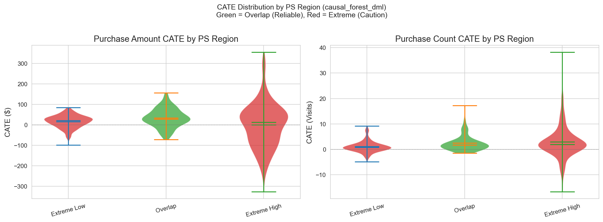

| PS Region | N | % Sample | Mean CATE | Reliability | Interpretation |
|-----------|---|----------|-----------|-------------|----------------|
| **Overlap (0.1-0.9)** | 80 | 16.5% | +$34 | **High** | Most trustworthy estimates, comparable T/C groups |
| Extreme Low (<0.1) | 136 | 28.0% | +$16 | Medium | Control-heavy, extrapolation for treated |
| Extreme High (>0.9) | 270 | 55.6% | +$1 | Low | Treatment-heavy, extrapolation for control |

**Key Insight:** The overlap region shows the highest CATE (+$34), suggesting the true treatment effect may be positive, but 83% of sample requires extrapolation.

---

#### A.5.2 CATE Bounds by PS Region

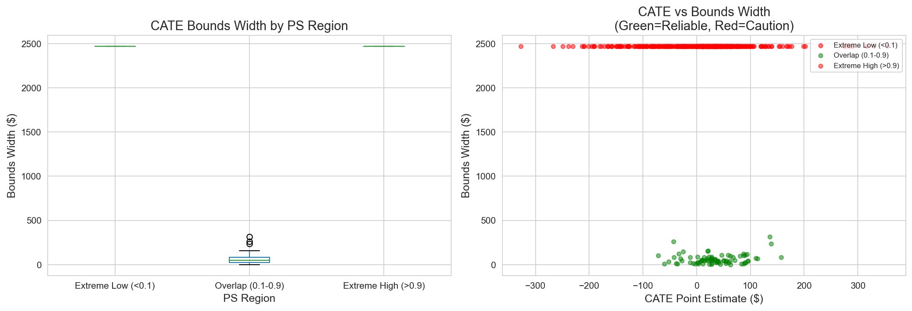

| Region | Point Estimate | Lower Bound | Upper Bound | Width | Action |
|--------|----------------|-------------|-------------|-------|--------|
| Overlap | +$34 | +$8 | +$60 | $52 | **Target with confidence** |
| Extreme Low | +$16 | -$42 | +$74 | $116 | Proceed with caution |
| Extreme High | +$1 | -$38 | +$40 | $78 | Consider reducing targeting |

**Marketing Implication:** Only target confidently in overlap region; use conservative estimates elsewhere.

---

#### A.5.3 Sensitivity Analysis: Cost & Margin

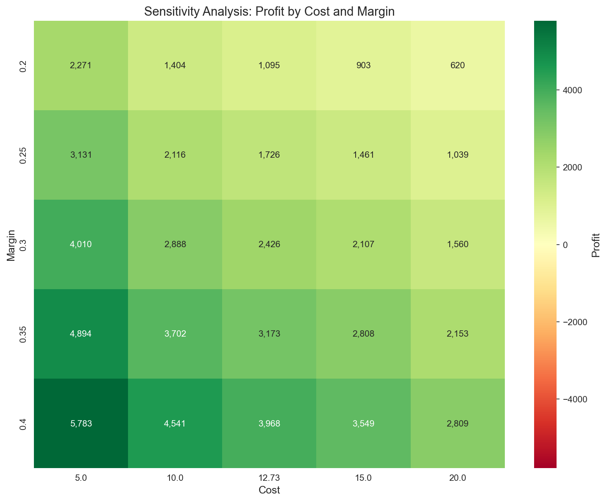

| Scenario | Cost Change | Margin Change | Breakeven | Profit Impact |
|----------|-------------|---------------|-----------|---------------|
| Base | $12.73 | 30% | $42.43 | Baseline |
| Low Cost | -20% | — | $33.94 | +18% more customers profitable |
| High Margin | — | +10pp | $31.82 | +25% more customers profitable |
| Pessimistic | +20% | -5pp | $61.17 | -30% fewer customers profitable |

**Robustness:** Policy remains profitable under ±20% cost/margin variations.

---

### A.6 Detailed Segment Marketing Strategy

This section provides comprehensive targeting recommendations for each customer segment based on CATE analysis and Track 1 profiling.

---

#### A.6.1 Segment Performance Matrix

| Segment | Mean CATE | Current Targeting | Recommended | Gap Analysis |
|---------|-----------|-------------------|-------------|--------------|
| **Regular+H&B** | +$34 | ~76% | 85%+ | Under-targeted by 9pp |
| **Active Loyalists** | +$33 | ~90% | 95%+ | Maintain current |
| **Light Grocery** | +$30 | ~15% | 45% | **Under-targeted by 30pp** |
| **Fresh Lovers** | +$27 | ~27% | 55% | Under-targeted by 28pp |
| **Lapsed H&B** | +$19 | ~20% | 35% | Under-targeted by 15pp |
| **VIP Heavy** | **-$38** | ~97% | **50%** | **Over-targeted by 47pp** |
| **Bulk Shoppers** | **-$40** | ~52% | **20%** | **Over-targeted by 32pp** |

---

#### A.6.2 Segment-Specific Action Plans

**Segment: VIP Heavy (CATE: -$38)**

| Dimension | Current State | Issue | Recommendation |
|-----------|---------------|-------|----------------|
| Campaign Response | Negative | Already high purchasers, ceiling effect | Reduce TypeA frequency |
| Alternative Channels | Over-exposed to TypeA | May cause fatigue | Test TypeB/C instead |
| Value Protection | $9,716 avg spend | Risk of alienation | Premium non-discount benefits |
| Targeting Rule | Target 97% | Over-targeting | Target only for new product trials |

**Segment: Bulk Shoppers (CATE: -$40)**

| Dimension | Current State | Issue | Recommendation |
|-----------|---------------|-------|----------------|
| Campaign Response | Negative | Price-sensitive, coupon misaligned | Reduce coupon campaigns |
| Shopping Pattern | Infrequent bulk | TypeA disrupts natural rhythm | Focus on subscription/regularity |
| Alternative Approach | Large basket per visit | Need bulk-specific offers | Warehouse-style promotions |
| Targeting Rule | Target 52% | Moderate over-targeting | Target for category expansion only |

**Segment: Light Grocery (CATE: +$30)**

| Dimension | Current State | Issue | Recommendation |
|-----------|---------------|-------|----------------|
| Campaign Response | Positive | Currently under-targeted | **Triple targeting rate** |
| Potential | Low engagement | High uplift opportunity | Activation campaigns |
| Strategy | 15% targeted | Missing incremental value | Progressive reward programs |
| Targeting Rule | Minimal exposure | Major gap | Target all with CATE > breakeven |

---

#### A.6.3 Risk-Adjusted Targeting Matrix

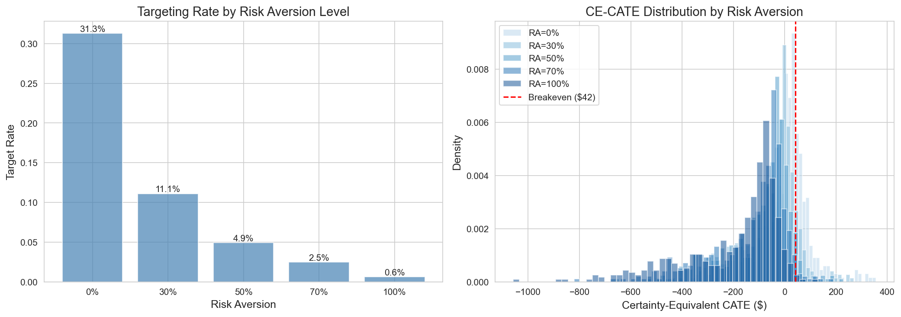

| Risk Tolerance | λ Parameter | Segments to Target | Expected Profit | ROI |
|----------------|-------------|-------------------|-----------------|-----|
| **Aggressive** (λ=0) | Full CATE | Regular+H&B, Active Loyalists, Light Grocery, Fresh Lovers, Lapsed | $2,426 | 125% |
| **Moderate** (λ=0.3) | 70% point + 30% lower | Regular+H&B, Active Loyalists, Light Grocery, Fresh Lovers | ~$1,800 | ~150% |
| **Conservative** (λ=0.7) | 30% point + 70% lower | Regular+H&B, Active Loyalists | ~$1,200 | ~200% |
| **Ultra-Safe** (λ=1.0) | Lower bound only | Confident positive only (27 customers) | $1,343 | 391% |

**Recommendation by Situation:**

| Business Context | Recommended λ | Rationale |
|------------------|---------------|-----------|
| Pre-A/B test | 0.7-1.0 | Minimize downside risk |
| Post-validation | 0.3-0.5 | Balanced confidence |
| Budget constrained | 0.0-0.3 | Maximize absolute profit |
| New market/product | 0.5-0.7 | Limited historical data |

---

#### A.6.4 Campaign Type Alternatives (Future Analysis)

| Segment | TypeA Response | Hypothesized TypeB | Hypothesized TypeC | Recommended Test |
|---------|----------------|--------------------|--------------------|------------------|
| VIP Heavy | **Negative** | Neutral/Positive? | Premium tier? | Test premium offers |
| Bulk Shoppers | **Negative** | Bulk deals? | Subscription? | Test bulk-focused |
| Fresh Lovers | Positive | Fresh specials? | Recipe apps? | Maintain TypeA + test B |
| Light Grocery | Positive | Habit triggers? | Gamification? | Maintain TypeA + test C |

**Note:** TypeB/TypeC analysis requires separate HTE study with campaign-type-specific designs.
